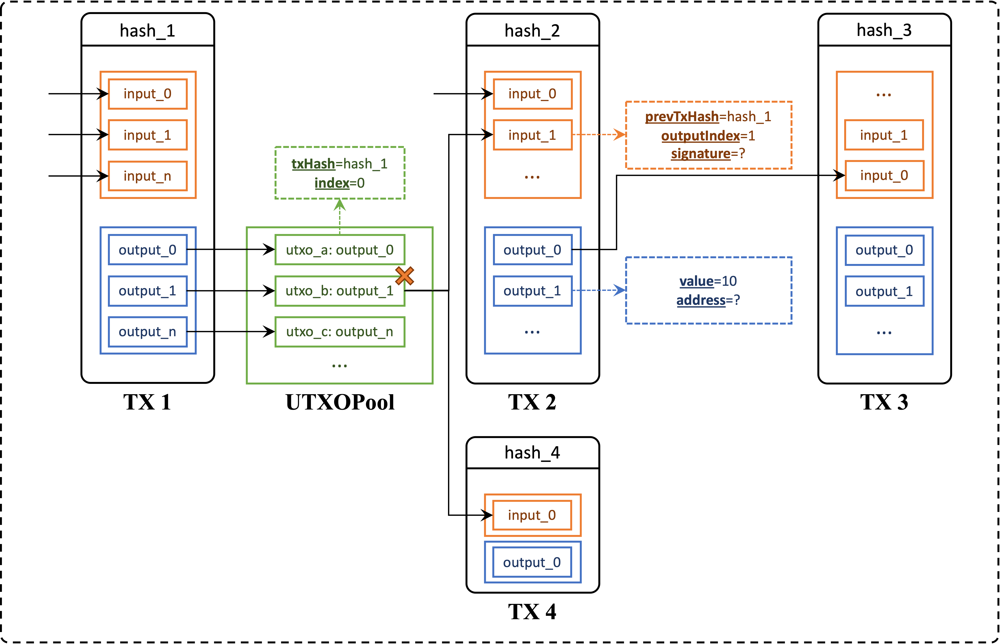
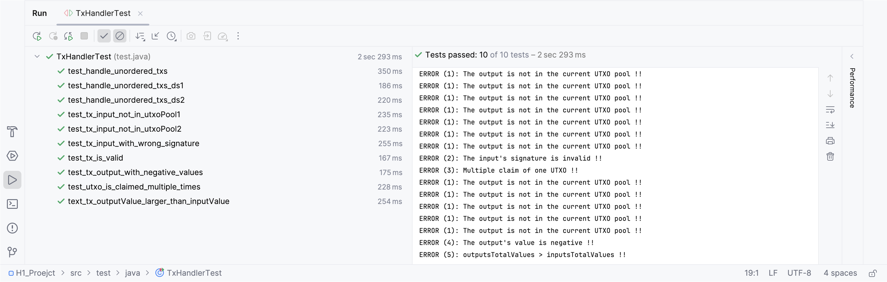

# H1 Project: ScroogeCoin

```python
H1_Proejct/
├── docs/
    ├── Homework_1.pdf # The need of homework 1.
    └── Images.pptx # The images of homework 1.
├── src/ # The source codes (code framework is following the maven framework).
    ├── main.java/ # The main classes.
        ├── Transaction.java
        ├── Crypto.java
        ├── UTXO.java
        ├── UTXOPool.java
        └── TxHandler.java
    ├── test.java/ # The test classes.
        └── TxHandlerTest.java 
└── .gitignore # The gitignore file.
```


## 1. Overview & Analysis

:pencil: The detailed requirements of homework 1 are in the `docs/Homework_1.pdf`:

- We will implement the logic used by Scrooge to **process transactions and produce the ledger**.
- Transactions can’t be validated in isolation; it is a tricky problem to choose a subset of transactions that are **together** valid.
- We will be responsible for **creating** a file called `TxHandler.java` that implements the required API and **testing** it.

This is a cryptocurrency trading process that matches what was taught in class. We need to write the transaction handler to ensure that the transaction is correct. 

:recycle: To complete this assignment, we must first analyze **the given class code**:

- ***Transaction***: Represents a ScroogeCoin transaction and has inner classes `Transaction.Output` and `Transaction.Input`. 
  - Consists of **a list of inputs**, which have a **value** and a **public key** to which it is being paid. 
  - Consists of **a list of outputs**,  which have the **hash of the transaction that contains the corresponding output**, the **index** of this output in that transaction, and a **digital signature**. The **raw data that is signed** is obtained from the `getRawDataToSign(int index)` method.
  - Consists of a **unique ID** (see the `getRawTx()` method).
  - Contains methods to **add and remove an input**, **add an output**, **compute digests** to sign/hash, add a signature to an input, and **compute and store the hash** of the transaction once all inputs/outputs/signatures have been added.
- ***Crypto***: Verifies a signature, using the `verifySignature()` method.
- ***UTXO***: Represents an **unspent transaction output**. 
  - A UTXO contains the **hash of the transaction** from which it originates as well as **its index** within that transaction.
  - Includes `equals()`, `hashCode()`, and `compareTo()` functions in UTXO that allow the testing of equality and comparison between two UTXOs based **on their indices and the contents of their txHash arrays**.
- ***UTXOPool***: Represents the **current set of outstanding UTXOs** 
  - Contains **a map** from each UTXO to its corresponding transaction output.
  - This class contains **constructors** to create a new empty UTXOPool or a **copy** of a given UTXOPool, and methods to **add and remove** UTXOs from the pool, **get the output** corresponding to a given UTXO, **check** if a UTXO is in the pool, and **get a list of all UTXOs** in the pool.

:page_facing_up: Based on these elements, we need to finish **implementing and testing** the `TxHandler` class:

```java
public class TxHandler {
  
    /** 
     * Creates a public ledger whose current UTXOPool (collection of unspent
     * transaction outputs) is utxoPool. This should make a defensive copy of
     * utxoPool by using the UTXOPool(UTXOPool uPool) constructor.
     */
    public TxHandler(UTXOPool utxoPool);
  
    /** 
     * Returns true if
     * (1) all outputs claimed by tx are in the current UTXO pool,
     * (2) the signatures on each input of tx are valid,
     * (3) no UTXO is claimed multiple times by tx,
     * (4) all of tx’s output values are non-negative, and
     * (5) the sum of tx’s input values is greater than or equal to the sum of
           its output values; and false otherwise.
     */
    public boolean isValidTx(Transaction tx);
  
    /** 
     * Handles each epoch by receiving an unordered array of proposed
     * transactions, checking each transaction for correctness,
     * returning a mutually valid array of accepted transactions,
     * and updating the current UTXO pool as appropriate.
     */
    public Transaction[] handleTxs(Transaction[] possibleTxs);
}
```

:gear: More detailed requirements:

- The implementation of `handleTxs()` should return a mutually valid transaction **set of maximal size** (one that **can’t be enlarged simply by adding** more transactions). It need not compute a set of maximum size (one for which there is no larger mutually valid transaction set).
- Based on the transactions it has chosen to accept, `handleTxs()` should also **update its internal `UTXOPool`** to reflect the current set of unspent transaction outputs, so that future calls to `handleTxs() ` and `isValidTx()` are able to correctly process/validate transactions that claim outputs from transactions that were accepted in a previous call to `handleTxs()`.


## 2. Implementation & Test

The runnable result code is in [`TxHandler.java`]( ./src/main/java/TxHandler.java) and [`TxHandleTest.java`]( src/test/java/TxHandlerTest.java ). In this section, I will elaborate on the class **implementation** and **test** code writing logic:

- The **implementation of TxHandler class**, which contains 3 methods: `TxHandler()`, `isValidTx()`, and `handleTxs()`. 
- The **test suite** to verify the implementation.

### 2.1 Details of the implementation

**Part 1. `TxHandler(UTXOPool utxoPool)`**

- This method is used to create a public ledger whose current UTXOPool is `utxoPool`.
- In order to make a defensive copy of `utxoPool`, I use the `new UTXOPool(UTXOPool uPool)` constructor.

```java
public TxHandler(UTXOPool utxoPool) {
    this.utxoPool = new UTXOPool(utxoPool);
}
```

**Part 2. ` boolean isValidTx(Transaction tx)`**

- This method is used to verify the validity of the given transaction.

- It returns `true` only if the transaction meets the following 5 conditions:

  - **(1) All outputs claimed by `tx` are in the current UTXO pool.**

    This condition makes sure that **all the inputs of the transaction are generated from past transactions' outputs.** To implement this, I go through all the inputs of the transaction, and check if the utxoPool (created from `TxHandler()`) contains the current input's utxo.

    ```java
    // (1) verify if all outputs claimed by tx are in the current UTXO pool
    if (!utxoPool.contains(curUTXO)) {
        System.out.println("ERROR (1): The output is not in the current UTXO pool !!");
        return false;
    }
    ```

  - **(2) The signatures on each input of tx are valid.**

    This condition makes sure that **people who paid the money is the money's owner**. To implement this, I go through all the inputs of the transaction and check if all the inputs' `publickey`, `message` and `signature` can match.

    ```java
    // (2) verify signature on each input of tx are valid
    if (!Crypto.verifySignature(preOutput.address, tx.getRawDataToSign(i), curInput.signature)) {
        System.out.println("ERROR (2): The input's signature is invalid !!");
        return false;
    }
    ```

  - **(3) No UTXO is claimed multiple times by tx.**

    This condition makes sure that **there is no double spending in the given transaction**. To implement this, for a certain input, I go through all the inputs after it to see if there is any input using the same UTXO with it.

    ```java
    // (3) ensure no UTXO is claimed multiple times by tx
    if (spentUTXOs.contains(curUTXO)) {
        System.out.println("ERROR (3): Multiple claim of one UTXO !!");
        return false;
    } else {
            spentUTXOs.add(curUTXO);
    }
    ```

  - **(4) All of tx's output values are non-negative.**

    This condition is easy to understand **because nobody will spend negative value of money**. To implement this, I go through all the outputs and check if their output value is non-negative.

    ```java
    // (4) ensure all of tx's output values are non-negative
    if (tx.getOutput(o).value < 0) {
        System.out.println("ERROR (4): The output's value is negative !!");
        return false;
    }
    ```

  - **(5) The sum of tx's input values is greater than or equal to the sum of its output values.**

    This condition is also easy to understand because except coinbase transaction, **no paycoins transactions will have the output values larger than the input values**. To implement this, I go through all the outputs and outpus, and sum the values of inputs and outputs respectively. 

    ```java
    // (5) ensure the sum of tx's input values is greater than or equal to the sum of its output values
    if (inputsTotalValues < outputsTotalValues) {
        System.out.println("ERROR (5): inputsTotalValues < outputsTotalValues !!");
        return false;
    }
    ```

**Part 3. `Transaction[] handleTxs(Transaction[] possibleTxs)`**

- Given an **unordered** array of proposed transactions, this method can check each transaction for correctness and then return a mutually valid array of accepted transactions, updating the current UTXO pool as well.
- Considering the input array is unorder, **some transactions may be valid due to other transactions' confirmation**. So I go through all the transactions **over and over again until no valid transactions can be found**. If there are valid transactions, update the utxopool. This could be kind of inefficient, but it can make sure there won't be any mistake!
- To implement this, I divide it into three steps:
  - **Step 1.** Go through all the transactions over and over again and record whether have new valid transaction or not. 
  - **Step 2.** Check the validity of each transaction using `isValidTx()`. If it is valid, add it into the `acceptedTxs` and update the `UTXOPool`: add new valid output & delete the spent utxo.
  - **Step 3.** If there is no new valid transactions can be found, stop going through all the transactions. The list  `acceptedTxs` is what we need!

:exclamation:  This is not the end of the analysis. After analyzing, it is easy to see that **it is difficult to deal with double spending without a timestamp**, because there is no way to tell which of the inputs using the same utxo is valid. As Figure 1. shows, **there is no way to determine whether TX2 or TX4 is valid**. Therefore, after talking with the TA, an additional assumption is made in this place: **for transactions with the double-spend problem, the one that is processed first is valid and the one that is processed later is invalid**, which is equivalent to a random selection.

> For example, in Figure 1:
>
> - if the processing sequence is `[TX1, TX2, TX4, TX3]`, then the `acceptedTxs = [TX1, TX2, TX3]`
> - if the processing sequence is `[TX1, TX4, TX2, TX3]`, then the `acceptedTxs = [TX1, TX4]`



<center>Figure 1. The example of transactions.</center>

### 2.2 Details of the test suite

Here, a **full range of black-box tests** need to be performed on the three functions implemented above. Simulating a real transaction between Scrooge, Alice and Bob will be very helpful for testing the functionality. To make things easier, some preparatory work has been done before completing the tests in turn.

**Some preparations for tests `@Before`**

- The original Transaction class did not have a function to sign, which means that it is a question of **where the signature in Input comes from**. Here, the `signTX()` function is added according to the `verifySignature()`method.
- I create the coinbase transaction `tx0` and initialize the `UTXOPool`. I also create other 9 translations (from `tx1` to `tx9`) **between Alice, Bob and Scrooge**. Some of them are correct while others are incorrect. The specific input-output relationships are shown in Figure 2.


<center>Figure 2. The transaction relationship for testing.</center>


**Tests for the `isValidTx()` function**

In order to present the testing process more clearly, I have made the test table form here.

| Test Function                                  | Test Purpose                                                 | Data for testing                                             | Expected Result             | Actual Result               |
| ---------------------------------------------- | ------------------------------------------------------------ | ------------------------------------------------------------ | --------------------------- | --------------------------- |
| `test_tx_is_valid()`                           | Test for valid transactions (which meet 5 conditions).       | Valid transaction `tx1`.                                     | `True`                      | `True`                      |
| `test_tx_input_not_in_utxoPoo1()`              | Test for UTXO not being containing in UTXOPool because the previous transaction hasn't happened. | Transaction `tx2` before and after transaction `tx1` being handled. | Before `False` After `True` | Before `False` After `True` |
| `test_tx_input_not_in_utxoPool2()`             | Test for UTXO not being contained in UTXOPool because of pointing the wrong previous transaction's index of outpout. | Transaction `tx3` with correct previous transaction `tx1` 's hashValue but wrong index. | `False`                     | `False`                     |
| `test_tx_input_with_wrong_signature()`         | Test for transaction with wrong signature.                   | Transaction `tx4` with wrong signature                       | `False`                     | `False`                     |
| `test_utxo_is_claimed_multiple_times()`        | Test for no UTXO is claimed multiple times.                  | Transaction `tx5` with double spending.                      | `False`                     | `False`                     |
| `test_tx_output_with_negative_values()`        | Test for all of transactions' output values are non-negative. | Transaction `tx6` with negative values of outputs even though the total amount of outputs less than the total inputs. | `False`                     | `False`                     |
| `text_tx_outputValue_larger_than_inputValue()` | Test for the sum of transactions' input values is greater than or equal to the sum of its output values. | Transaction `tx7` with output > input even though each output amount is less than the total inputs. | `False`                     | `False`                     |

Note that all the testing data with certain deficiencies can become the valid transactions only if we fix the deficiencies. This can be ensure that the data for testing are suitable for the certain circumstances we want.

**Tests for the `handleTxs()` function**

In order to present the testing process more clearly, I have made the test form here.

| Test Function                     | Test Purpose                                                 | Data for testing                                             | Expected Result   | Actual Result     |
| --------------------------------- | ------------------------------------------------------------ | ------------------------------------------------------------ | ----------------- | ----------------- |
| `test_handle_unordered_txs()`     | Test for an unordered array of proposed transactions (some are valid, and some are invalid). | `{tx3, tx4, tx5, tx6, tx7, tx2, tx1}`                        | `{tx1, tx2}`      | `{tx1, tx2}`      |
| `test_handle_unordered_txs_ds1()` | Test the first situation of double spending in different txs. | `{tx2, tx8, tx9, tx1}`, where `tx2` and `tx8` are double-spending | `{tx1, tx2}`      | `{tx1, tx2}`      |
| `test_handle_unordered_txs_ds2`   | Test the second situation of double spending in different txs. | `{tx8, tx2, tx9, tx1}`, where `tx2` and `tx8` are double-spending | `{tx1, tx8, tx9}` | `{tx1, tx8, tx9}` |

I strongly recommend that you refer to Figure 2. for the observations made here!

:100: **Test results in my environment**

In my environment (details of which are described below), **all of the above 10 test functions passed**, as shown in Figure 3.



<center>Figure 3. The test results in my environment.</center>


## 3. Environment

:e-mail: Because JDK versions are updated so quickly, there are a lot of things in the old code that will be wrong in the new JDK version, such as the `finalize()` function. It is highly recommended to **install Java 8 instead of the latest version of the JDK**. 

:star2: **All of the code in this repo is run on the MacOS (M2) with JDK1.8, [junit-4.13.2](https://repo1.maven.org/maven2/junit/junit/4.13.2/junit-4.13.2.jar) and [hamcrest-1.3](https://repo1.maven.org/maven2/org/hamcrest/hamcrest-all/1.3/hamcrest-all-1.3.jar)**. Just download the `.jar` files and use the `file => project structure` to organize them.


## References

:books: Actually, the homework for this class **haven't changed since 2018**. For the 2018 to 2019 academic year, the siblings use GitHub to manage the tasks, so you can find a ton of [**references**](https://github.com/search?q=PHBS_BlockChain&type=repositories).

There are 2 high quality open-sourced codes we can refer to. Thanks for the siblings!

- [**JiZhong Cao**](https://github.com/1901212561/PHBS_BlockChain_2019/)
- [**TingWei Shen**](https://github.com/SnakeWayne/PHBS_BlockChain_2019)

:warning: In addition to these direct references, the framing of background content is critical, and further study of the [**references cited by the instructor**](https://zhuanlan.zhihu.com/p/121039362) in class can be done here.

