# Block Chain Mid-Term Review Note

> Karry Ren
>
> 本 Note 以郑老师上课 PPT 为基础，结合 2019 年考试真题进行整理。
>
> 覆盖了 PPT 所讲重点内容，梳理整体框架，并尽可能命中考点。[Ref.](https://www.bilibili.com/video/BV1Vt411X7JF?spm_id_from=333.788.videopod.episodes&bvid=BV1Vt411X7JF&vd_source=66823c3216b82637e31f708a5e627a0b&p=18)
>
> ```java
> // Part 1. Foundation 
> Lecture 1. Review and MerkleTree // 基础内容
> 
> // Part 2. Bitcoin
> Lecture 2. Background Introduction // 比特币的基本运行原理
> Lecture 3. Digital Signatures // 加密手段
> Lecture 5. Transcript Applications // 交易的验证
> Lecture 6. Double Spending and Network // 具体难题破解和网络构造
>   
> // Part 3. Ethereum
> ```


## Lecture 1. Review and MerkleTree

> 第一章进行了 BTC 密码学基础的复习和 MerkleTree，主要集中在 Hash 算法的含义以及 MerkleTree 的介绍上。

### 1.1 Cryptographic Hash Functions

**Hash Functions: Mathematical Function with following 3 properties**

- The input can be **any string** of any size.
- It produces a **fixed-size** output. (say, 256-bit long)
- Is **efficiently** computable. (say, *O(n)* for *n*-bit string)
- For two subtly different inputs, there is no guarantee that the function will produce a hash value with little difference.

**A Hash Function is cryptographically secure: If it satisfies the following 3 security properties**

> <font color="red">**【判断题】A cryptographic hash function needs to be collision resistant and hiding. 【T】**</font>

- **Property 1: Collision Resistance.** A hash function $H$ is said to be collision resistant if it is infeasible to find two values, $x$ and $y$, such that $x != y$, yet $H(x) = H(y)$. In other words: If we have $x$ and $H(x)$, we can “never” find an $y$ with a matching $H(y)$, such that $H(x) = H(y)$. **No $H$ has been proven collision-free.** 

  > Application: Hash as a Message Digest. If we know that $H(x) = H(y)$, it is safe to assume that $x = y$.
  >
  > Example: To recognize a file that we saw before, just remember its hash.

- **Property 2: Hiding.** Given $H(x)$, it is **infeasible** to find $x$. A hash function $H$ is said to be hiding if when a secret value r is chosen from a probability distribution that has **high min-entropy**, then, given $H(r || x)$, it is **infeasible** to find $x$ (“$r || x$” stands for “$r$ concatenated with $x$”, “High min-entropy” means that the distribution is “very spread out”, so that no particular value is chosen with more than negligible probability).

  > Application: Commitment. Commitment Scheme consists of two algorithms:
  >
  > - `com := commit(msg,key)` takes message and secret key, and returns commitment.
  > - `verify(com,msg,key)` returns `true` if `com = commit(msg,key)` and `false` otherwise.
  >
  > We require **two security properties**:
  >
  > - Hiding: Given com, it is infeasible to find msg.
  > - Binding: It is i**nfeasible to find** two pairs `(msg,key)` and `(msg’,key’)` s.t. `msg != msg’` and `commit(msg,key) == commit (msg’,key’)`.

- **Property 3: “Puzzle Friendliness”.** A hash function $H$ is said to be puzzle friendliness if for **every** possible n-bit output value $y$, if $k$ is chosen from a distribution with high min-entropy, then it is **infeasible to find** $x$ such that $H(k || x) = y$, **in time significantly less than $2^n$​.** If a hash function is puzzle friendly, then there is no solving strategy for this type of puzzle that is much better than trying random values of x.

  > Application: Bitcoin mining (SHA-256) is just such a computational puzzle. 其产生的是一个 256 位的 Hash 值。

**Hash of Blocks**

- `hash of block = H (nonce | previous hash |transactions)`
- Nonce is the only input variable to be tuned to change output. (当然，矿工也可以通过修改 Block 中的 Transactions 来改变 hash 值，选择小费少的多进行尝试，不要那么贪心)

### 1.2 Qualified (Valid) Blocks: Proof of Work

> <font color="red">**【选择题】What are the main reasons for miners to provide proof-of-work when claiming validated blocks: a) To allow all miners to have a fair chance to get block reward; b) To encourage miners to work together in groups such as mining pools; c) To adjust the production rate of the blocks; d) To prevent Sybil and DoS attacks. <u>*ac*</u>**</font>
>
> <font color="red">**【问答题】Explain 3 key roles of miners for Bitcoin to work properly. 1)验证交易; 2) 打包成块; 3) 产生新币**</font>

A certain amount of computing power must be spent over time to find a qualified block. The quantitative metrics for qualifying are **Difficulties**. A valid block is a block whose hash falls into the target space. The number of bits in the block's **hash that starts with a zero - the more bits zero, the more work**. 很明显如果前面的 0 越多，符合条件的 Hash 值就越少，打中的概率就越低。

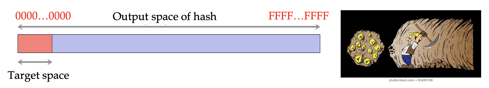

**Difficult to solve but easy to verify**: The more bits in the hash value of a block that starts with a zero, the higher the workload and the corresponding difficulty. Finding the qualified hash value, that is, finding the qualified block, is very difficult and requires a lot of time and energy, so it is called **mining**.

**结合 BTC 的设计理念，我们可以发现 BTC POF 中的如下特征**

- The goal of the Bitcoin network is to produce one block in **ten minutes on average**, so the difficulty criteria (number of leading 0) is adjusted to make that happen. 难度动态调整如下图所示
- The only way to find the hash value of a block that meets the above difficulty condition is to change the value of Nonce, given the transaction record and the hash pointer fixed or chosen. 调节随机数进行挖矿
- The Bitcoin network requires that the mining difficulty be adjusted **every 2016 blocks**, and 2016 is exactly two weeks, so the time interval for each difficulty adjustment is **about two weeks**.


Not strictly one block **every 10 minutes**. Some blocks take more time to generate and some blocks take less time. **On average**, a block is generated roughly every 10 minutes.

### 1.3 Hash Pointer

**Hash Pointer is:**

- pointer to **where** some info is stored (表示指向信息的地址)
- (cryptographic) **hash** of the info (Typically SHA-256 is used) (表示指向地址的 Block 中的 `Hash = SHA(HashPointer||infor)`)

**Given a Hash Pointer, we can**

- ask to get the info back (因为可以找到目标地址的 Block，进而获取信息。所以说们有时候只需要保存最近的几个区块，当用到前面的区块时，我们再去向其他节点要相关的区块)
- verify that it hasn’t changed (对 info 进行重新 hash 进行比较就可以验证内容是否被篡改了)

**Blockchain is Tamper Resistant**

- Once a transaction has been recorded inside a blockchain, it is very difficult to change it. 很难被篡改
- If some transaction gets changed, then the hash of the block and the hash pointer contained in the following block won’t match. 因为一旦一个被篡改就会引发连锁反应，后续的所有都被篡改掉了 
- It is easy to identify where the modification happens. 进行 hash 就可以检验到底是哪个除了问题

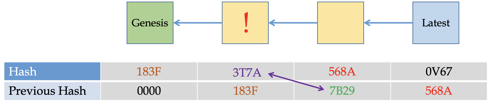

**Chained Reactions**

- A change of hash pointer will cause the hash of the whole block to change. 连锁反应，大厦倾倒
- In order to make the blockchain valid again, all following blocks of the downstream of the blockchain have to be altered.
- In reality, technically infeasible!

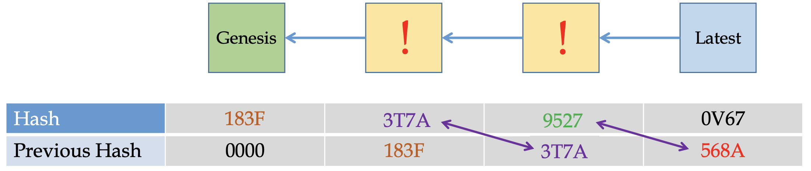

**Shortcoming**

We can use hash pointer in any pointer-based data structure **that has no cycles**. 如果存在环，就会产生循环依赖，是不行的！也就是说：**不是所有的数据结构都可以使用 Hash Pointer 进行构造！**

### 1.4 Merkle Tree

> <font color="red">【**选择题】Which of the followings are the characteristics of a Merkle Tree? a) Binary Tree; b) Non-leaf nodes are hashes; c) Linked List; d) Search algorithm with a complexity of O(N), where N is the number of nodes included in the Merkle Tree. <u>*ab*</u>**</font>

**Definition**

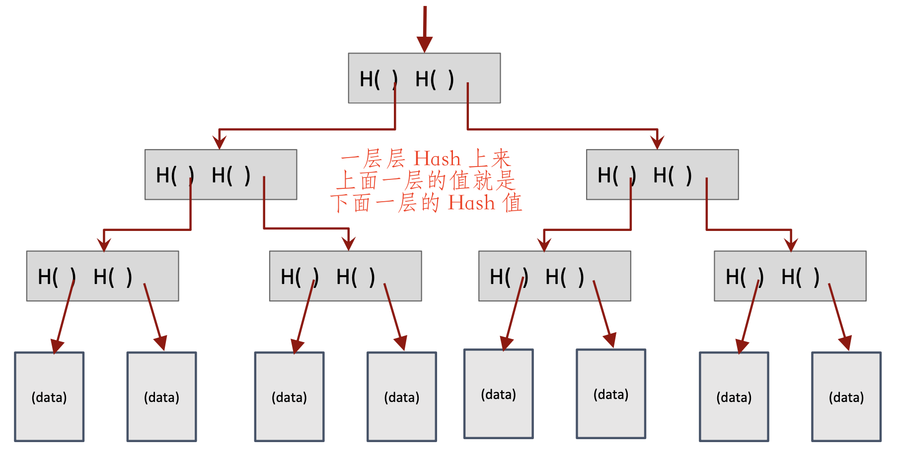

Merkle Tree 的思路来源和传统二叉树类似，只不过 Node 的地址变为了 Node 中数据的 Hash 值，通过 Hash 值进行位置所定。内部节点都是 hash pointer，leaf 是 data block（交易数据transaction），对根节点取 hash 就是 root hash。构造 Merkle Tree 的过程是自底向上的：

- Suppose you hava $n=8$ files, denoted by $(f_1, f_2,\dots,f_8)$, you have a collision-resistant hash function $H$ and you want to build up a Merkle Tree.
- You start by hashing each file as $h_i = H(f_i)$. (倒数第一行)
- Then you hash again b continuing to hash every two adjacent hashes. (倒数第二行)
- In the end, you only live once, so you'd better hash these last two hashes as $h_{1,8} = H(h_{1,4}, h_{5,8})$. (根节点)

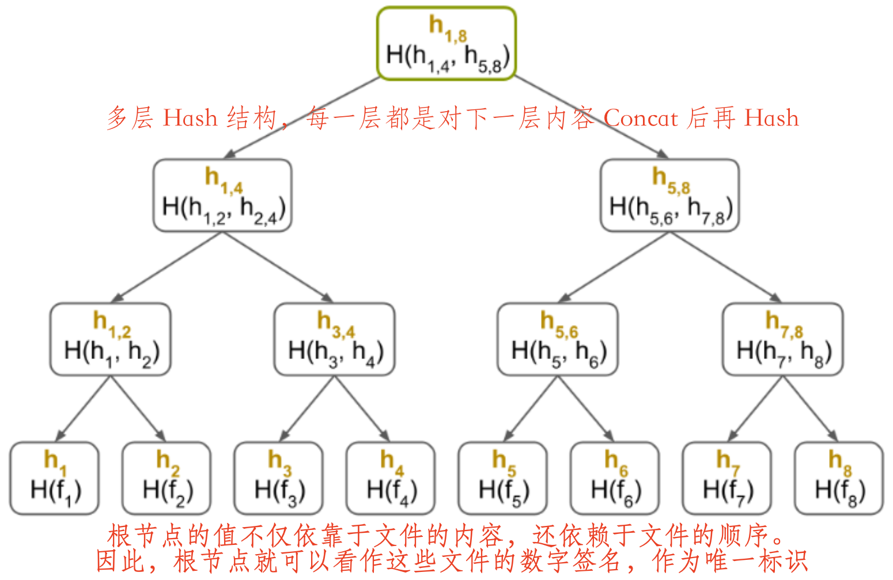

是不是只能对 $2^n$ 个叶子构造 Mekle Tree ? NO! 可以将非 $2^n$ 个叶子节点通过复制得到最小满足的 $2^n$ 个叶子节点。

**Proving Membership in a Merkle Tree**

证明某一个叶子节点在 Merkle Tree 中是重要的应用，因为仅使用轻节点(Light Node)就可以完成验证 (SPV - Simplified Payment Vertification)。如下图所示假设黄色 tx 想知道他是否被包含在这个区块上：

- 现在这个黄色的轻节点 tx 只有一个 $H(tx)$ 值，他先向一个全节点发出请求，全节点发送了三个红色的 $H()$
- 借助红色的 $H()$ 和其自身的 Hash 值，待验证节点就可以从本地依次从下到上计算出三个绿色的 $H()$。过程很简单：先算出第一个，再让其和获取到的红色的拼接再计算下一个绿色的 $H()$，依次向上。
- 最后把计算出的根 Hash 值和 Block Chain 中保存的进行比较，就可以完成验证

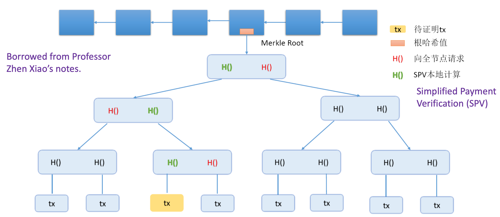

To prove that a data block is included in the tree only requires showing **blocks in the path from that data block to the root**.

**Using Merkle Tree to Prove**

Merkle Tree 算法起源是帮忙**快速查找元素是否在 List 中**，将复杂度从 $O(n)$ 降低到 $\log_2(n)$​ 。Tree holds many items, but just need to remember the root hash.

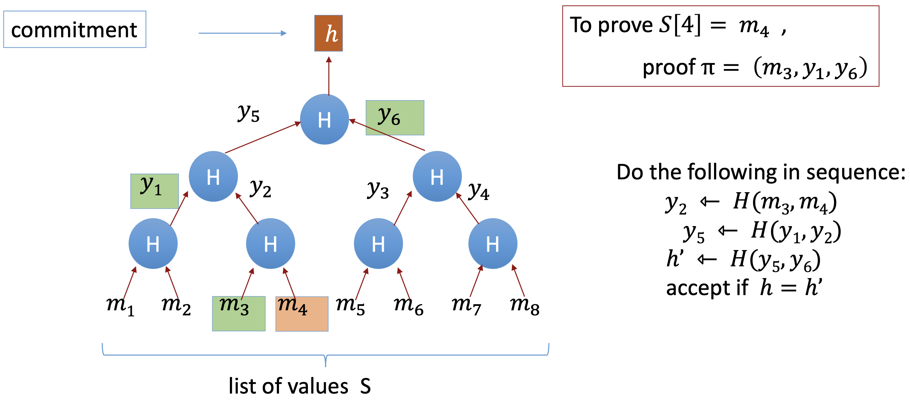

在此基础上进行改进 Sorted Merkle Tree 可以**方便查找元素是否不在 List 中**。将 leaf 按照 hash 值排序，然后对需要**被验证的元素取哈希**看位于哪两个 leaf 之间，只要能证明这两个 leaf 能够推到 root 正确，就说明这两个 leaf 是近邻的，进而说明待验证的元素不在其中。

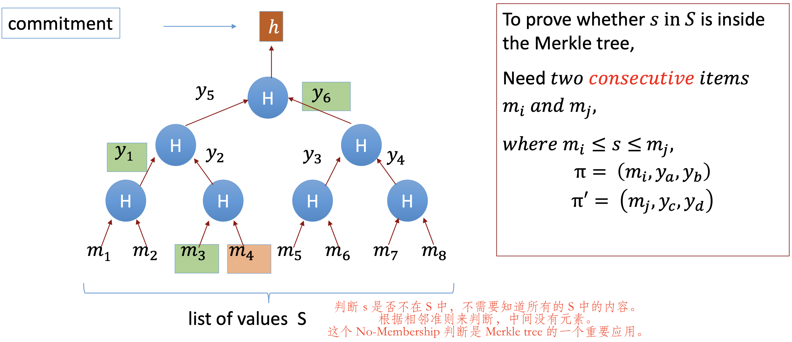


## Lecture 2. Background Introduction

> 本章对 BTC 的运行的基础机制进行了详细说明。

### 2.1 Foundation

**Participants of Private Digital Currency World**

Miners, users, and speculators. There is a dynamic weak equilibrium among the three types of participants.

**The difficulties**

- Double Spending – 双花 (双重支付攻击) ：电子媒介容易被复制
- Sustainability 运营成本的控制和可持续性
- Challenges to the existing legal currency system 对现有法币体系的挑战
- How to achieve the consistent global anti-money laundering regulatory goals 全球的一致的反洗钱的监管目标如何实现

**What Block Chain Can Do**

- Avoid double spending 规避双花问题
- Allow anonymous transactions 允许匿名交易
- Guarantee transaction completion 保证交易完成
- Convenient to realize transaction 方便实现转账

**What is Block Chain**

Blockchain is **a list of blocks** with an order. The blocks contain Bitcoin transactions. A transaction consists of **senders, receivers, and amount of Bitcoins** to be transfered. The transaction is **peer to peer** without any third party involved. Bitcoin Blockchain is a Bitcoin **transaction ledger**. 本质上来说 Block Chain 就是分布式记录 Transaction 的账本。

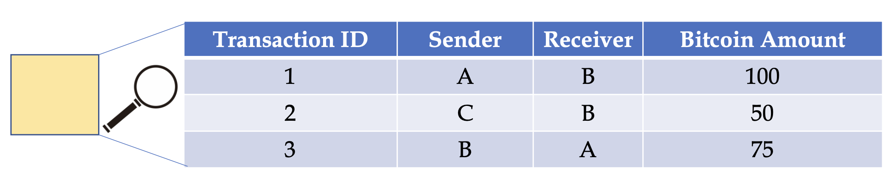

<font color="red">**【应用题】Below is a summary of a block in the Bitcoin blockchain. Decide whether the following statements are True or False and briefly explain why.**</font>

<font color="red">**(a) The block height X cannot be bigger than 210,000; T. 因为每过 210,000 Block Reward 就会减半，该 Block 的 Block Reward 是 50，说明是前 210,000 个 Block。**</font>

<font color="red">**(b) The mining time T is around the year 2016; F. 按照 Block 的规则设定，每 4 年 Block Reward 就会减半，图中 Reward 仍为 50，说明距离第一个区块被创建间隔时间小于 4 年，也就应该是在 2014 年 1 月 3 日之前。**</font>

<font color="red">**(c) The transaction fee F must be zero. F. Transaction fee 不一定为 0，相反一般来说都是非 0 的。**</font>

**Bitcoin Transaction**

有关 Bitcoin 的交易，存在以下众多要点：

- 公开透明：Bitcoin transaction is **public and transparent**, everyone can see it (consists of the sender, the recipient, and the amount of the transaction)
- 匿名处理：Each sender and receiver is an address (addresses are also unique hashes that can be created at will, providing anonymity)
- 认可有效：Anyone can send a transaction, but the transaction is only valid if it is acknowledged by everyone (booked into the blockchain)
- 签名认证：The first element for a transaction to be valid is to prove that you have the digital currency of the sender's address
- 加密处理：Each transaction is encrypted with the **recipient's public key and can only be decrypted with a signature generated by the recipient with the correct private key** (a transaction can be thought of as a letter delivered through a publicly locked mailbox that can only beopened by the recipient with the correct mailbox key (private key))
- UTXO：Each transaction consumes some digital currencies (spent) and generates one or several digital currencies (unspent). A digital currency that has already been consumed cannot be reused (combined with the first element in the previous page)

**Block Sturcture**

Each block has 3 key parts:

- a hash pointer pointing to the previous block
- transactions
- hash of the whole block.

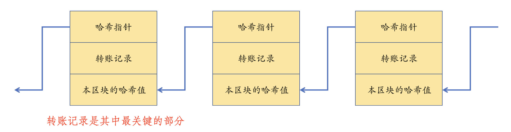

注意到，因为每一个 Block 的大小是有上限的（起初大概是 1MB），因此一个区块中能存储的转账记录数也是有限的。区块中的交易记录可以分为有转出方的（正常交易 + 给矿工的 Fee Reward）和没有转出方的（矿工挖矿的奖励 Block Reward）。比特币都是被矿工挖出来的，数量也是人为设计的：

- 矿工奖励每 210,000 个区块减半（按照每 10 分钟一个区块，大概每 4 年减半一次）
- 总和很简单就能算出来 $210000*50*(1 + \frac{1}{2} + \frac{1}{4} + \cdots + \frac{1}{2^n}) = 2100000$

目前 Genesis Block 中的 Coinbase 仍然未被花出去，This is a symbolic pointer to the dangers of centralized issuance of national currencies, in the midst of the global financial crisis.（一旦被花出去可能是加密被破解的信号）

<font color="red">**【计算题】The total Bitcoin supply is around $21 \times 10^6$, that we learn in class is in fact an approximation. Anyway, we are going to derive this number. Please be reminded that (i) the block reward in the first stage was $50$ Bitcoins and (ii) the block reward is halved every $210,000$ blocks. Block rewards actually becomes zero when it goes below $1 \times 10^{−8}$ (1 Satoshi), which is the smallest Bitcoin unit. However, we can assume that the reward can continue being halved infinitely.**</font>

<font color="red">**(a) Using the facts and the assumption above, prove that the total Bitcoin supply is $21 \times 10^6$. The exact Bitcoin supply is $20999999.9769$ (taking the reward actually becoming zero into consideration). So $21 \times 10^6$ is very close.**</font>

<font color="red">**Answer: $210000*50*(1 + \frac{1}{2} + \frac{1}{4} + \cdots + \frac{1}{2^n}) = 2100000$**</font>

<font color="red">**(b) The total Bitcoin in existence up to today is about $18 \times 10^6$. If Nakamoto designed the block reward in such a way that it begins with 100 Bitcoins (instead of 50) and the other conditions remain the same, what would be the supply up to today?**</font>

<font color="red">**Answer: $2 \times 18 \times 10^6 = 36\times 10^6$**</font>

### 2.2 Blockchain Applications

因为区块链存在难修改，信息透明的特性（All share the same property tamper resistant – history is history!），所以在 Health Care，Supply Chain，Notary 等领域都有很多的应用。

### 2.3 Tech Background

**Cryptographic hash functions** 这个在 Lecture 1 中讲得很清楚了。

**Proof of Work** 这个在 Lecture 1 中也讲得很清楚了。

**Why Mining ?**

Bitcoins as incentives! Miners deserve to be rewarded for helping users record transactions, including the transaction fees that users give to miners in addition to the block rewards in Bitcoin's initial design.

<font color="red">**【判断题】Miners collect transaction fees as their incentive to mine blocks.【T】**</font>

**Process of Mining**

> 挖矿的结果是：
>
> - Bitcoin transactions are **recognized and recorded into the blockchain** as consensus
> - Bitcoins are **consumed** and new Bitcoins are **created** and ready to use

- 找到最新区块：Find the latest blocks on the blockchain if possible.
- 整理交易：Select some transaction records and do a check on those transactions to make sure there are no double spending
- 挖矿找值：Put the transaction records together with the hash pointer and **find the right block** hash by adjusting the Nonce
- 广播区块：Broadcast the qualified block **to everyone ASAP**, praying that the block is accepted as the latest block
- 广泛认可：By the time the block is officially confirmed as the newest member of the blockchain, the reward is also confirmed by everyone

**Dangers Point**

- 比特币来自于矿工的无中生有：Here's where the magic comes in: bitcoins are created out of thin air by miners.
- 只有别人承认的才算数：Whether or not you own bitcoins is determined by the distributed consensus of others: if everyone says you have money, you have money, if everyone says you don't have money, you don't have money. 因此如果有一个人掌握了 50% 以上的挖矿节点，那么就可以为所欲为了 (51% 攻击).

**Decentralized Distributed Database**

- 信息对所有人公开：The blochchain is completely **open to anyone** on the internet.
- 内容分布式处理实现复制：The blockchain is replicated and propagated over the whole network, and therefore is essentially a distributed database.
- 去中心化：There is no central administrator – decentralized. 多数人确认才行，**时间优先，最长链优先**.

### 2.3 Double Spending

**Definition**

- The double spend problem refers to the same amount of money used to make two or more payments

  >User A has only 100 bitcoins in total, and he transactions 100 bitcoins to User B (T1) and 100 bitcoins to User C (T2). T1, T2 which transaction will be confirmed? Who gets the 100 bitcoins? The conclusion is uncertain !

- For traditional currencies or under centralized regulation, it can't happen

- For digital currencies, such as Bitcoin, it is a big problem because the consensus mechanism takes time to reach

**Solution**

- 公开信息 + UTXO 状态：Bitcoin blockchain information is **public and open to all**. Bitcoin blockchain is robust in that all information is repeatedly backed up and propagated by the network, and can be seen as a distributed database system.
- 投票获胜：Decentralized consensus mechanism: most confirmations to work, time first, longest chain first.
- 反复确认：Usually **more than 6** confirmations are needed, which corresponds to more than 1 hour (就算有一个人确认了也还不能被认定，还需要更多人参与进来，但这也给了不法分子时间差).

<font color="red">**【判断题】Bitcoin transactions are absolutely secure and anonymous. 【F】**</font>

<font color="red">**【选择题】What is the minimum number of confirmations required to guarantee a Bitcoin transaction to be permanently recorded in the longest blockchain: a) 1; b) 6; c) 100; d) None of the above. *<u>b</u>***</font>

### 2.4 Decentralization *vs* Centralization

**Decentralization**

- Information has **redundancy** and is scattered (分散) throughout the network
- Updates to information can be initiated (发起) by anyone
- Benefit: not easily corrupted (损坏)
- Problem: consensus (一致性) is not easy to reach

**Centralized**

- Information generation, updating, and sharing are all initiated by one credit department
- Benefits: Efficiency and consistency
- Problem: Dependence on the credit of one central department

<font color="red">**【判断题】A Bitcoin wallet needs to store the entire block chain to work properly.【F】**</font>


## Lecture 3. Digital Signatures

> 详细说明了数字签名的核心概念

### 3.1 Foundation

**What do we want from signatures ?**

- Only you can sign, but anyone can verify.
- Signature is tied to a particular document, i.e., cannot be cut-and-pasted to another document, `Sigature = Sign(Private Key, Content)`.

**Digital Signature Scheme consists of 3 algorithms**

- 生成公私钥：`(sk,pk) := generateKeys(keysize)` generates a key pair

  - `sk` is secret key, used to sign messages
  - `pk` is public verification key, given to anybody

  <font color="red">**【判断题】 Private keys can be derived from public keys.【F】**</font>

- 生成签名：`sig := sign(sk, msg)` outputs signature for msg with key `sk`.

- 验证信息：`verify(pk,msg,sig)` returns `true` if signature is **valid** (signature corresponds to msg) and `false` **otherwise**.

**Signatures must be unforgeable!**

就算知道了公钥和一次的签名也无法构建出后续的签名，无法伪造。An adversary who knows `pk` and has seen signatures on messages of her choice cannot produce a verifiable signature on a new message.

**Digital Signatures in Practice**

- Key generation algorithms must be randomized and need good source of randomness. 我们在代码中会规定 key 的长度，并且用特殊的随机数进行密钥的生成。
- Sign and verify are expensive operations for large messages. Fix: use H(msg) rather than msg. 用 Hash 函数对 msg 进行压缩

**How to generate the Key Pair? RSA Signatures!**

- `KeyGen()`: Same as RSA encryption:
  - Public key: `N` and `e`
  - Private key: `d`
- `Sign(d, M)`: Compute $H(M)^d \mod N$
- `Verify(e, N, M, sig)`: Verify that $H(M) ≡ sig^e\mod N$

<font color="red">**【应用题】Alice wants to send a message to Charlie, but she has to send the message to Bob first and then asks Bob to relay the message to Charlie. Alice does not want to reveal the message content to Bob and Charlie wants to be able to verify whether Bob changes the message. Use the public/private key cryptography knowledge that we learned in class to design an algorithm to help Alice achieve her goal. Use a diagram for illustration if needed.**</font>

- <font color="red">**Key Generation:** Alice and Charlie generates private-public key pair for themselves.</font>
- <font color="red">**Message Encryption:** Alice encrypts the message using Charlie's public key.</font>
- <font color="red">**Digital Signature:** Alice signs the encrypted message with her private key.</font>
- <font color="red">**Transmission:** Alice sends the encrypted message along with her signature to Bob.</font>
- <font color="red">**Relaying:** Bob forwards the message and signature to Charlie.</font>
- <font color="red">**Signature Verification:** Charlie verifies the signature using Alice's public key.</font>
- <font color="red">**Message Decryption:** If the signature is valid, Charlie decrypts the message using his private key.</font>

### 3.2. Identity

**How to Create a new Identity ?**

可以看到，在 BTC 中没有明确的账户概念，一个随机生成的公私密钥对就是一个帐户！

- Create a new, random key-pair `(sk, pk)`. `pk` is the public “name” you can use (usually better to use `Hash(pk)`). `sk` lets you “speak for” the identity.
- You control the identity, because only you know `sk`.
- If `pk` “looks random”, **nobody needs to know who you are**.

**Decentralized Identity Management**

By creating a key-pair, anybody can make a new identity at any time and can make as many as you want! These identities are called ***addresses*** in Bitcoin. 可以创建无穷多个账号，每个帐号的含义是收钱地址。

**Identities and Privacy**

Addresses **are not directly connected to real-world identity**. But observer can link together an address’ activity over time, and make inferences about real identity.

### 3.3 Transaction-based Ledger

在完成了第一次作业后，看这个地方是很清晰的，所谓的 Inputs 就是对 Output 的**解锁**过程，或者说是取钱过程，只有拿出签名才能取到资金。这个地方**填写签名是必考点**，一定是 Sender，表示从之前的 Receive 过程中取钱！

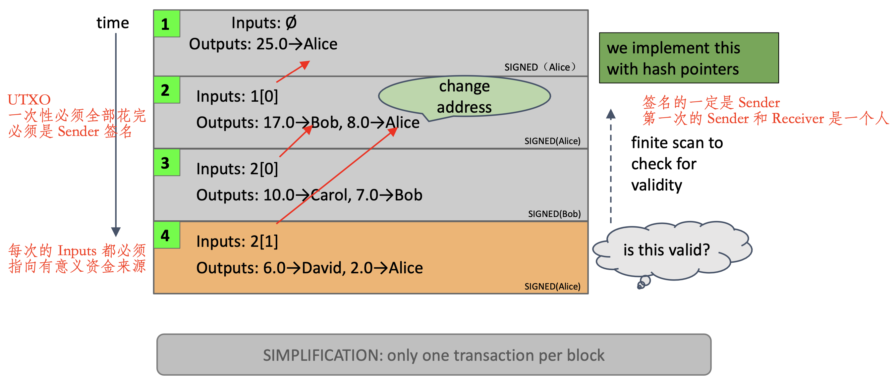

除了记录以上正常的交易，还有一些 Transaction 可以被进行（或者 Miner 自己构建一个）：

- Merging Value

  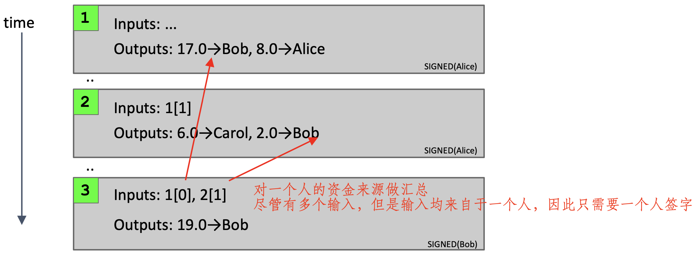

- Joint Payment

  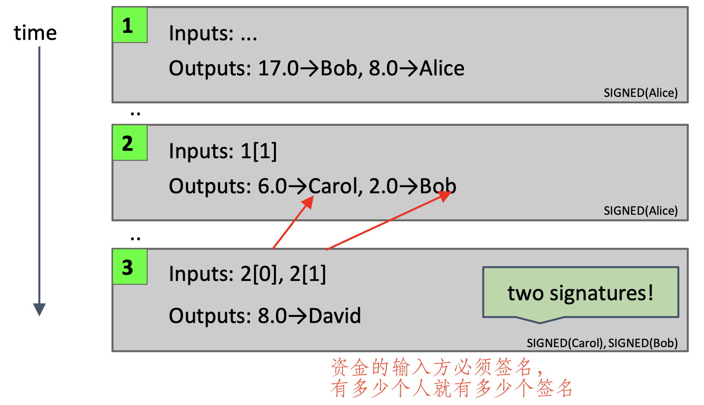

### 3.3 The Real Deal of Transactions

我们的作业 1 已经很细致地说明了一个 Transcript 中的内容 metadata、 inputs 和 outputs 是最重要的部分：

> <font color="red">**【选择题】 A Bitcoin transaction includes the following parts: a) Block header; b) Metadata; c) Inputs; d) Outputs. *<u>bcd</u>***</font>

- metadata 包括该交易的一些基础性信息
- input 含有前一个 output 所在 Tx 的 Hash 和 output 的 idx，以及自己的 Signature
- output 含有目标 Key 和 Value

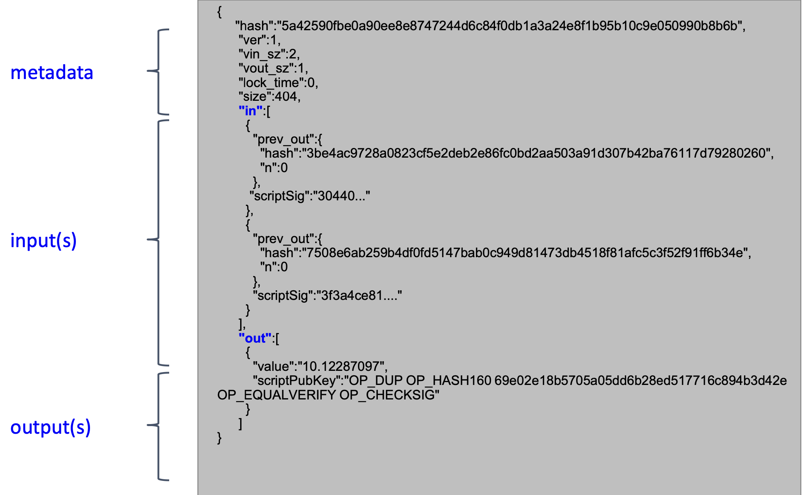

但在实际操作的时候用到的是 Script 的概念，为了验证 `B => C` 的 input 是否正确，需要与对应 output 的 script 进行拼接，然后运行

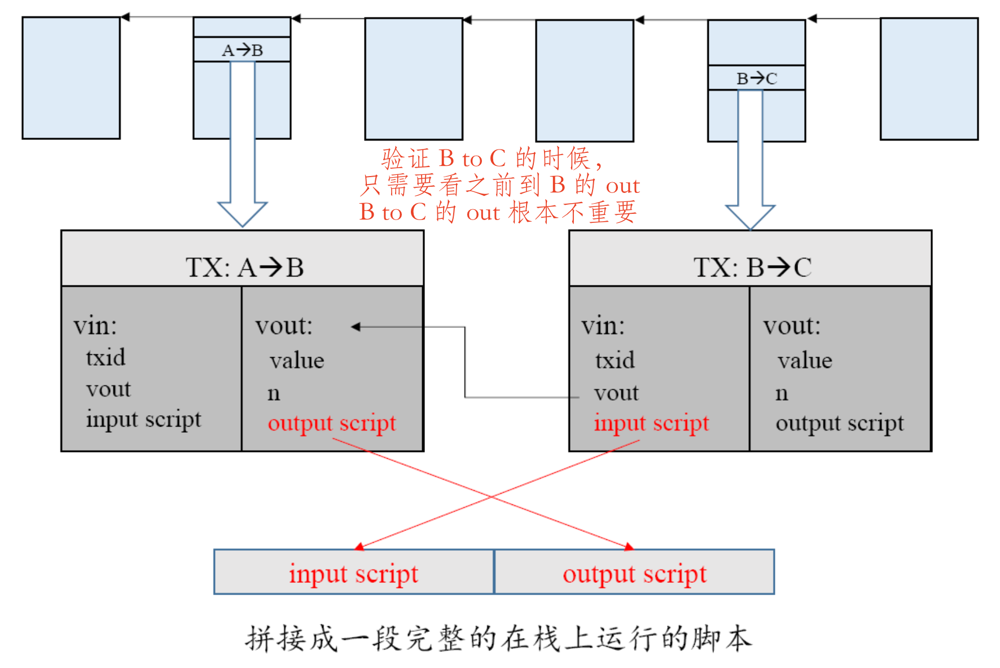

**Why Script ?** Design “goals”:

- Built for Bitcoin (inspired by Forth)
- Simple, compact
- Stack-based
- No looping
- Support for cryptography
- Limits on time/memory
- Not Turing complete!

**`OP_CHECKMULTISIG` 被单独列出来进行介绍**

Built-in support for joint signatures. Specify *n* public keys. Specify *t*. Verification requires *t* signatures. Incidentally: **There is a bug in the `multisig` implementation**. Extra data value popped from the stack and ignored. 这个 Bug 不能被修复，因为一旦修复就会**出现硬分叉**，再也无法合并。


## Lecture 5. Transcript Applications

> 这一章核心讲解 Transactions 到底如何被 Miner 验证有效的。

### 5.1 Transactions Need Verification

Transaction verifications are done by miners.

Verifications usually consist of 2 parts for **every single input**:

- The user who initiates the transaction (sender) has the money: is done by **matching the sender’s pubkey** to the incoming transaction’s destination **recipient address**. (地址匹配)
- The user who initiates the transaction (sender) can use the money: is done by **executing the concatenated signature script (scriptSig) and output script (scriptPubKey)**. (身份正确)

其中前者很好验证，直接比较是否相等即可，但是后者需要进行脚本的正确执行。[**Ref.**](https://zhuanlan.zhihu.com/p/121039362)

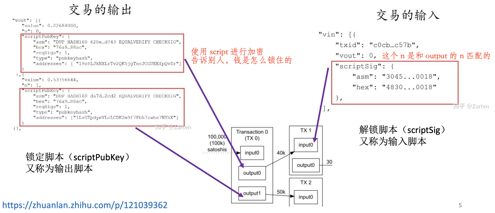

### 5.2 Scripts Detail

**Basic**

在比特币交易脚本是基于栈的表达式语言，是一种**非常简单的语言**，功能被设计的比较有限，只能做很少的操作，可以在简单的嵌入式硬件设备运行。比特币脚本语言是经过精心设计的语言，**具有非图灵完备性**，跟现代编程语言很大区别，除了有条件的流控制以外，没有循环或复杂流程控制能力，这样做的好处是确保了不能用于创建无限死循环和其他各种“定时炸弹”。脚本的作用在于验证交易的合法性，所以比特币系统中每一笔交易都需要通过脚本验证，验证通过则交易达成，验证不通过，交易不达成。

**scriptPubKey**

锁定脚本（scriptPubKey）又称为输出脚本。锁定脚本是一个放在 UTXO 输出上的花费条件，它指定了今后花费这笔比特币必须满足的条件。通俗的理解就是：比如 Zarten1 转给 Zarten2 5BT C时，当这一笔交易完成时，都有一个或多个输出保存在 UTXO 中，这些输出里面就包含有锁定脚本，那今后 **Zarten2 需要使用这 5BTC 时必须要满足锁定脚本里的条件才能使用**。如上面的图中的锁定脚本所示，其中的核心是：1) 加密脚本的类型(`type:pubKeyHas`); 2) 目标地址(`addresses`).

**scriptSig**

解锁脚本（scriptSig）又称为输入脚本。解锁脚本是解锁锁定脚本的，存在于输入脚本中。通俗来讲，同样使用上面的例子，今后Zarten2 使用这 5BTC 时，就需要使用解锁脚本来解锁存在 UTXO 中的锁定脚本才能使用继续转账这 5BTC 给下个接收方。由于 UTXO 中存着的是 Zarten2 的 5BTC，所以也是只有 Zarten2 的签名才能解锁，其他人无法解锁来花费，并提供 Zarten2 自己的公钥，方便其他节点来验证。

### 5.3 Transaction Verify

**验证交易合法性**

比特币中的节点将**拼接解锁脚本和锁定脚本一起来执行，若执行通过，则此交易验证通过，否则交易验证不通过**。 拼接格式：解锁脚本（scriptSig）+锁定脚本（scriptPubKey），从左到右依次压入栈中执行。交易脚本的形式主要有 3 种，后续将一一说明：

- P2PK (Pay to public key)
- P2PKH (Pay to public key hash)
- P2SH (Pay to script hash)
- 多重签名

**P2PK (Pay to public key)**

这种形式是最简单的，锁定脚本直接给出的是**收款人的公钥**。

```java
scriptSig:
    PUSHDATA(Sig) // 栈中压入了 Sig（input 中使用 data + private key 生成的）
scriptPubKey:
    PUSHDATA(PubKey) // 栈中又压入了 PubKey
    CHECKING // 对 Sig 和 PubKey 进行验证
```

详解：由于 UTXO 锁定脚本里面给出的是收款人的公钥，比如收款人是 Zarten1，那么只有 Zarten1 带有自己的签名（对应的私钥生成），公钥才能验证通过，其他人无法验证通过，所以交易也不会通过。

**P2PKH (Pay to public key hash)**

锁定脚本中给出的是**收款人的公钥的哈希**，这种形式是最普遍常用的。

```java
scriptSig:
    PUSHDATA(Sig) // 解锁脚本里的签名压入栈
    PUSHDATA(PubKey) // 解锁脚本里的公钥压入栈
scriptPubKey:
    DUP // 接下来进入锁定脚本里面，将栈顶元素复制一遍
    HASH160 // 将栈顶元素弹出并取哈希，将哈希值再压入栈
    PUSHDATA(PubKeyHash) // 锁定脚本里公钥的哈希（也就是收款人的地址）压入栈
    EQUALVERIFY // 弹出栈顶的 2 个元素，并比较是否相等，若相等则从栈消失，不相等则非法
    CHECKING // 用公钥检查签名是否正确，正确返回TRUE，验证通过，交易合法，否则交易非法
```

详解：比如现在 UTXO 的锁定脚本中存的是收款人 Zarten1 的地址（公钥的哈希值），所以第 4 步将解锁脚本里提供的 Zarten1 的公钥取哈希后看是否相等（也就是看是不是同一个收款地址），这样做的目的是防止黑客冒充 Zarten1。并且还有如下好处：

- 通过哈希隐藏了公钥，只有在需要花费资金时才提供公钥，这增加了攻击者获取公钥的难度，从而提高了交易的安全性；
- 使用公钥哈希，数据量更小，有助于提高交易效率；

**P2SH (Pay to script hash)**

这种形式中，锁定脚本中给出的**不是收款人的公钥也不是收款人的公钥的哈希值**，而是一个赎回脚本（redeemScript）的哈希值（redeemScriptHash）。解锁脚本中需要给出的是**序列化的赎回脚本**，用于取哈希后是否跟锁定脚本相等。赎回脚本里面的**内容也是脚本**，形式有：P2PK、P2PKH 等，脚本的内容是锁定脚本中的内容。

```java
scriptSig:
    PUSHDATA(Sig) 
    PUSHDATA(serialized redeemScript) 
scriptPubKey:
    HASH160
    PUSHDATA(redeemScriptHash)
    EQUAL
```

所以 P2SH 验证交易的时候分为 2 步，第一步执行完毕后紧接着执行第二步：

- 第一步：验证序列化的 redeemScript 的哈希值是否与锁定脚本提供的 redeemScriptHash 相等
- 第二步：反序列化解锁脚本中的 redeemScript，并执行 redeemScript 里面的内容

> 来一个例子来看一下，比如赎回脚本的内容是 P2PK
>
> ```java
> redeemScript:
>     PUSHDATA(PubKey)
>     CHEKING
> scriptSig:
>     PUSHDATA(Sig) 
>     PUSHDATA(serialized redeemScript) 
> scriptPubKey:
>     HASH160
>     PUSHDATA(redeemScriptHash)
>     EQUAL
> ```
>
> - 第一步：执行 `scriptSig` 和 `scriptPubKey`，最后只留下 Sig 在栈中
> - 第二步：先反序列化 redeemScript，然后就相当于单独执行 P2PK，`CHECKING(PubKey, Sig)`

总结：通过前面 P2PK 和 P2PKH 的 2 个例子应该不难理解上面的执行过程。从上面可以看到，为何使用赎回脚本搞得这么复杂呢？最开始比特币系统中是没有 P2SH 的，后来通过软分叉加入了这个功能。其实 P2SH 主要的应用场景是对多重签名的支持。

**多重签名**

多重签名即需要多个人的签名，比如：某个公司账户，有 5 个合伙人，解锁脚本中只需给出 3 个合伙人的签名就能转走公司账户的比特币，这样做的一个好处是为**比特币账户的丢失提供了冗余**，即使有 1 到 2 个人的私钥丢失了也无妨，增加了容错。

- **早期的多重签名（已不推荐使用）**。早期的多重签名中，转账的复杂度都暴漏给用户了，非常不方便。举个例子：用户 Zarten 需要给电商公司付款时，Zarten 需要**先了解公司多重签名的规则后再转账**：转账的锁定脚本中要给出 5 个人（N 表示总人数）的公钥并给出 M 个人的数目，N 和 M 不一定相等十分复杂。解锁脚本（也就是公司账户）中按顺序给出 M 个人的签名。如下所示：

  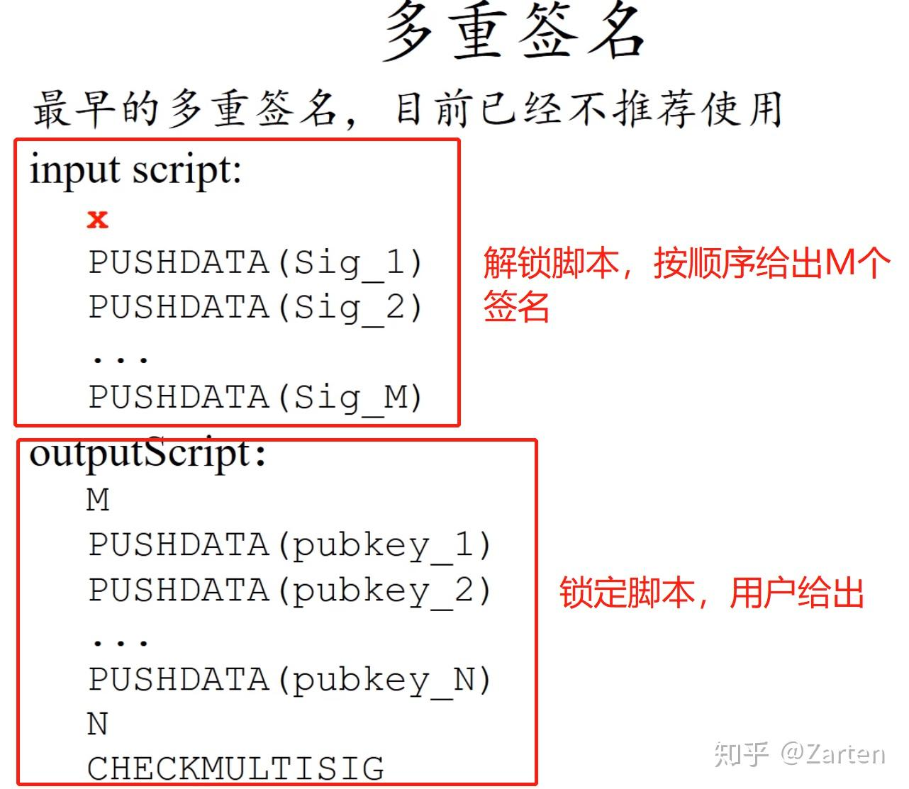

  从上图看到，解锁脚本中有一个红 ×，这是 `CHECKMULTISIG` 的实现存在一个 bug（执行时会从堆栈上多弹出一个元素），已无法更改，为了能迁就这个 bug，需要在栈顶多压入一个无关元素。

  上图中解锁脚本与锁定脚本拼接后依次入栈，最后使用`CHECKMULTISIG` 依次用公钥检查签名是否正确，就可验证交易是否合法。

  **总结：**从上面可以看到，多重签名的这种方式对用户来说太不友好了（**买个东西还要了解你的规则，还要自己来拼凑你的规则**）。为了解决这个痛点，P2SH 很好的解决了这一点。

- **P2SH 实现多重签名**。基于上面的痛点，我们很容易就能想到，如果“接收方”把规则封装起来，发送方就可以很容易地运行了。之前学到的 P2SH 中的 redeemScript 就用上了。现在的做法是：将多重签名的规则放在赎回脚本（redeemScript）中，**收款人只需提供赎回脚本的哈希值即可**（比如：公司将这个哈希值张贴在电商网站首页），这样对于用户来说付款地址只有这个哈希值，就跟普通转账一样了。至于验证多重签名转到了解锁脚本（公司）中。如下所示：

  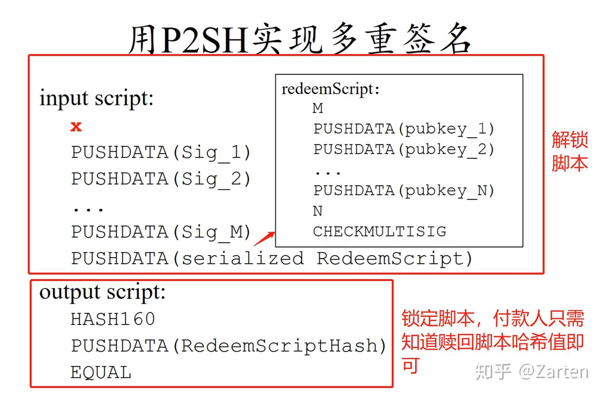

  **总结：**从上面可看到，复杂度由锁定脚本转移到了解锁脚本中，锁定脚本中只有简简单单的 3 行。**目前的多重签名大多都采用 P2SH的形式了。**P2SH 的 Workflow 为：

  ```java
  1. Bob
      - hashes the redeem script
      - sends redeem script hash to Alice.
  2. Alice
      - creates a P2SH-style output containing Bob’s redeem script hash.
  3. When Bob wants to spend the output
      - provides his signature along with the redeem script in the signature script.
  4. P2P network then
      - ensures the redeem script hashes to the same value as the script hash Alice put in her output;
      - it then processes the redeem script exactly as it would if it were the primary pubkey script,
      - letting Bob spend the output if the redeem script does not return false.
  ```

- 多重签名可以用于一些复杂的场景。

**Real Transaction ScriptPubKey Examples**【必考点】

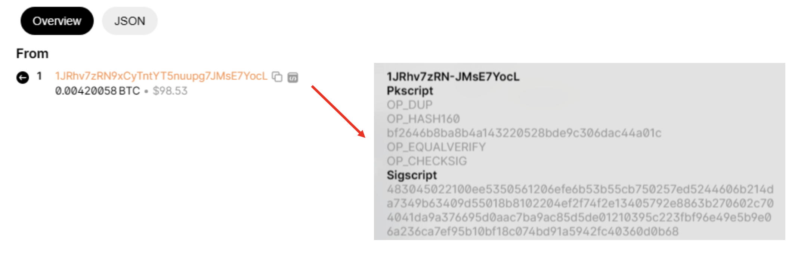

Input 是明摆的，进行 P2PKH 只需给出 Sig 和 PubKey


一个 Transaction 中不同的 Output 可以有不同的验证方法，上面的明显就是 P2SH，下面的是 P2PKH。

如果直接给 output 的 pkScript 你能否判断是哪种发送方式？是可以的！

```java
"pkscript": "76a914bf2646b8ba8b4a143220528bde9c306dac44a01c88ac", // P2PKH
"pkscript": "a9146ab5fb3b06cce0a04adfc46d97242a76638f5ec587", // P2SH
"pkscript": "a9149614150f8a091bb32644aafc579923a0cc86181d87", // P2SH
"pkscript": "76a914bf2646b8ba8b4a143220528bde9c306dac44a01c88ac", // P2PKH
```

**原因是前缀固定：P2PKH 的 pkScript的比特流前缀是 `76a914`，P2SH的pkScript的比特流前缀是 `a914`。**

### 5.4 Bitcoin Blocks

**Why bundle transactions together ?**

- Requiring consensus for each transaction separately would **reduce transaction acceptance rate**.
- Hash-chain of blocks is **much shorter**.
- **Faster** to verify history.

**Bitcoin Block Structure**

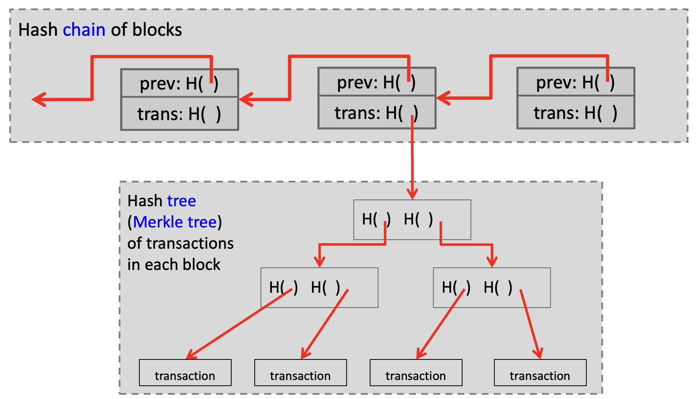

**Content**（选择题）

- Bitcoin Block 里面包含: block header, transaction data 和 hashed during mining (hash, nonce, mrkl_root)
- Transaction Data: input, output 和 metadata

**coinbase Transaction**

New coins are created with **coinbase** transaction (每一个 Block 都有一个 coinbase transaction):

- Single input field and Single output
- Does not redeem previous output
  - **Hash pointer is null (indicating actually no inputs at all)**
- Output value is miner’s revenue from block:
  - **output value = mining reward + transaction fees**
  - transaction fees come from all transactions in block
- Special **coinbase** parameter
  - contains arbitrary value

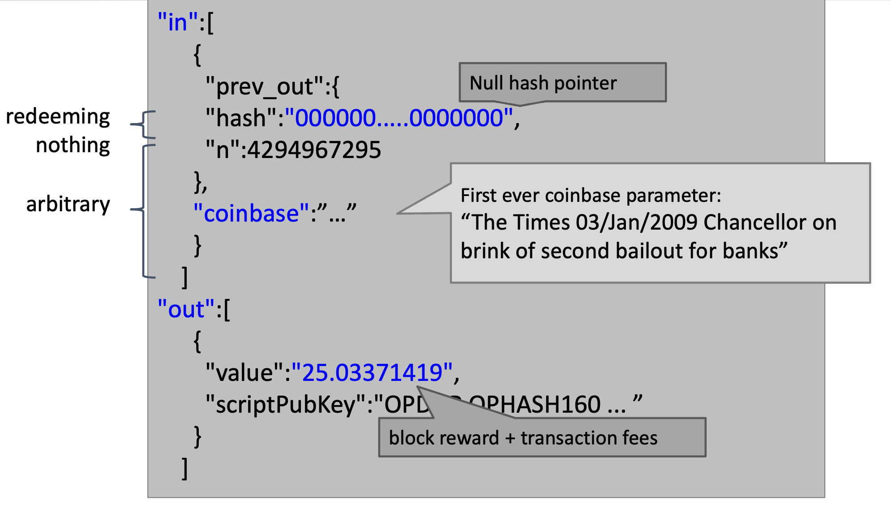


## Lecture 6. Double Spending and Network

> 之前已经将 Block Chain 的基础框架全部搭好了，现在聚焦一些比较关键的问题

### 6.1 Double-Spending

之前我们考虑 Input 和 Output 之间要实现签名匹配，才能保证 Tx 是 Valid 的，但是除了这些要求，我们还有其他很多额外要求。

**A valid transaction consumes (and destroys) some coins, and creates new coins of the same total value**

> Coins are Immutable (不可改变的). They cannot be transferred, subdivided (细分), or combined.

- consumed coins valid (address verification),
- not already consumed,
- total value out = total value in (including the tips paid to miners),
- signed by owners of all consumed coins

**UTXO** — BTC 杜绝双花的核心机制

- The term UTXO refers to **unspent transaction output**
- The amount of Bitcoin someone has left remaining after executing a transaction.
- Any coin can be created once and consumed only once. 
- Thus, the **Bitcoin blockchain is transaction based ledger, not account based.**

**How UTXO Gets Updated?**

第一次作业看到如何针对 Txs 进行 UTXO 的更新，在完成第二次作业 blockChain 的过程中我们看到了如何对一个 Block 进行 UTXO 管理

- Each node keeps a set of UTXO to its best knowledge. 每一个节点都有一个 UTXO
- Each node verifies the blockchain and updates the UTXO on its own. 每一个节点用涵盖的 Txs 来更新 UTXO
- Will those transactions not included in the Blockchain affect the UTXO status? 不会影响，只有看到的 Txs 才有影响

### 6.2 Bitcoin Network

**How Bitcoin Network Works ?**

- Two layers of network:
  - Application layer: Bitcoin Blockchain. 应用在 BTC 上，这是实打实的载体，一个个 Block 就是网络上的节点 Node
  - Network layer: P2P network. 本质是一个 P2P 网络，传输信息
- Distributed consensus protocol for application layer
- Simple, robust, best-effort, not very efficient (因为需要不断获取信息，速度上不有效同时存储上不有效)

BTC 网络采用的是 Light Node 模式，不需要每一个 identity 都掌握 Full Node 信息，需要的时候去网络中获取（可能会导致不一致）

**How Transactions Are Handled ?**

- Transactions are generated by nodes (Blocks), either users and miners
  - Coinbase transactions by miners
  - Transfer transactions by users
- When a transaction is generated by a node, it gets broadcasted into the P2P network

**How Blocks Are Handled ?**

Transactions 生成后，被 Miner 打包成 Block 成为节点放在 Network 中广播，别人进而可以获取进行后续操作。

- Transactions are saved and verified by miner nodes, and packaged by miner nodes into a block
- The block gets broadcasted via the P2P network as soon as possible
- Transactions already packaged into blockchain will be marked by nodes to be excluded when packaging new blocks

**Bitcoin P2P Network**

> Participants can
>
> - publish transactions
> - insert transactions into block chain

- Ad-hoc protocol (runs on TCP port 8333)
- Ad-hoc network with random topology
- **All nodes are equal**
- New nodes can join at any time
- Forget non-responding nodes after 3 hr

**Transaction Propagation**

当一个 Block 产生新的 tx 的时候，需要进行广播让其他节点知道，这叫做信息的流动 (Flooding)，个人节点是否要接力进行信息的传播本质是一个博弈论的问题，需要注意如下几点：

- Transaction valid with current block chain
- (default) script matches a whitelist
  - Avoid **unusual** scripts
- Haven’t seen before
  - Avoid **infinite** loops
- Doesn’t conflict with others I’ve relayed
  - Avoid **double-spends**

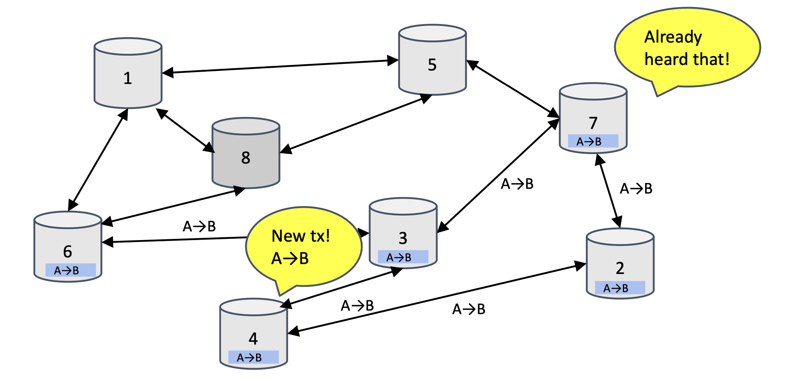

**Race Conditions**

Nodes may differ on transaction pool. 有的节点广播的是 `A => B` 但有的节点说是 `A => C`。产生了冲突的情况下，如何化解？这种出现冲突的情况就叫做 **Race Conditions**，处理这种冲突的原则有有很多

- Default behavior: accept **what you hear first** (最先原则)
- Tie broken by whoever mines next block (最长链原则)
  - picks only one transaction/block
- Network position matters
- Miners may implement other logic !


**Block Propagation**

Relay a new block when you hear it if:

- Block meets the hash target: hash 值符合挖矿原则
- Block has all valid transactions (Run all scripts, even if you wouldn’t relay) Transactions 必须符合目标
- Block builds on current longest chain: Avoid forks 最长链原则

**Size of the Network**

可以看到，因为网络效应的存在，Block Chain 整个网络的**大小随时间呈指数型爆炸**。因此如果问现在 BTC 网络到底有多大? Impossible to measure exactly !

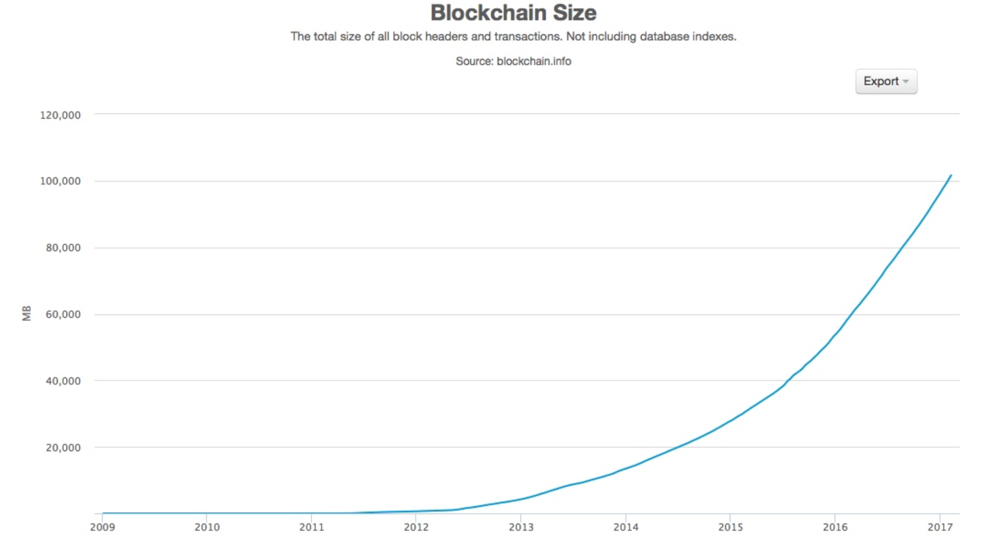

- Estimates-up to **1M IP addresses/month**
- Only about 5-10k “full nodes” (This number may be dropping! 这些节点可以忽略不计)
  - Permanently connected
  - Fully-validating: **Permanently connected**; Store **entire block chain**; Hear and forward every node/transaction

**Thin/SPV Clients (not fully-validating)**

正因为 Blockchain 的 Size 爆炸增长，所以必须找到一个合理的方法进行存储，按照如下的轻存储可以节约 1000 倍的空间

- Idea: **don’t store everything**
- Store block headers only Request transactions as needed To verify incoming payment
- Trust fully-validating nodes

**Software Diversity**

About 90% of nodes run “Core Bitcoin” (C++). 也就是说不是所有的 BTC 代码都是 C++ 的。


### Lecture 7. Ethereum

> 到了上一章 BTC 的内容就全部讲完了，认识到了它的优点和缺点，从这一章开始引入以太坊 (Ethereum) 进行升级讲解

### 7.1 Ethereum Overview

**Motivation: Why we need Ethereum ?**

- Bitcoin blockchain aims to facilitate the transfer of bitcoins
- What else can be done?
  - Transfer of other coins or even fiat currencies? (打造新的币种)
- How to motivate miners to keep mining (providing services)?
  - Instead of voluntary service fees, make it mandatory (转换挖矿方式)

**What are the changes in Ethereum ?**

- UTXO seems cumbersome (麻烦) and Bitcoin scripts only support **limited functions and computation**
- Introducing accounts to keep track of balance: The balance of all accounts needs to be saved into ledger (BTC 是 transaction 驱动的，没有 ledger 导致如果要算 balance 需要遍历全链，十分麻烦)
- The whole network becomes a distributed state machine and the block chain keeps track of the changes of states. Each full node (miner) keeps a snapshot/copy of the state machine. (改变 Block 的存储内容，由一个个发生的 Transaction 动作，变成一个个状态快照，这样最新的 Block 中存储的就是最近的状态快照)

**Overview of Ethereum**

- Ethereum is **a decentralized platform designed to run smart contracts**
  - Smart contracts are **executable codes**
  - Distributed computer to execute executable codes
  - **Account-based blockchain**
  - Transactions => State transition function 不存储 Txs 而是存储状态转移方程
  - Blocks => Snapshots of state machines 块中存储的是状态机的快照
- Ethereum has a native asset called ether (以太币). (Basis of values in the Ethereum ecosystem)

<font color="red">**Compare with BTC: Explain the state machine abstractions of Bitcoin and Ethereum respectively and tell 3 major differences between Bitcoin and Ethereum.**</font>

- 状态机抽象解释：
  - 比特币的状态机抽象：比特币的状态机抽象主要围绕着**未花费交易输出（UTXO）展开**。在比特币网络中，每一笔交易都会消耗之前的 UTXO，并创建新的 UTXO。整个系统通过维护这些 UTXO 的集合来记录用户的资产和交易状态。状态机的核心逻辑是验证交易的合法性，包括检查数字签名、确保交易输入的 UTXO 未被花费等。当一笔交易被验证为有效后，它会更新 UTXO 集合，从而改变系统状态
  - 以太坊的状态机抽象：以太坊的状态机抽象则基于**账户模型**。它维护一个全局的状态，其中包含了所有账户的信息，包括账户余额、存储数据和代码等。每一笔交易或智能合约的执行都会触发状态的变更。以太坊的状态机需要处理更复杂的操作，如执行智能合约代码、更新账户状态、处理消息调用等。其核心逻辑不仅包括交易验证，还涉及智能合约的执行和状态的持久化。
- 三个主要区别：
  - **共识机制**。BTC 用的是 PoW 而 ETH 用的是 PoS
  - **功能和应用场景**。BTC 就是被用作一个去中心化的交易手段，功能简单。但是 ETH 因为有智能合约的存在可以部署复杂的应用
  - **交易处理的方式**。比特币的交易处理基于UTXO模型，每笔交易需要明确指定输入和输出，这使得交易验证相对简单，但处理复杂逻辑的能力有限。以太坊采用账户模型，交易可以直接改变账户的状态，并且能够触发智能合约的执行，这使得它在处理复杂交易和应用逻辑时更加灵活。

**Smart Contract**

智能合约是以太坊中最为重要的一个概念之一，因为这是其操作的对象。其本质并不是一段文字性的描述，而是一段可执行代码

- Unlike an ordinary contracts, written or spoken agreement , which is intended to be enforceable by law
- A smart contract is **some executable code** that facilitates, verifies, or enforces the negotiation or execution of a digital agreement (Example: 一段可执行的转账代码)

### 7.2 Account

**Foundation**

就像是在银行用到的帐户一样，可以存储当前的余额，进而进行**一键查看**。

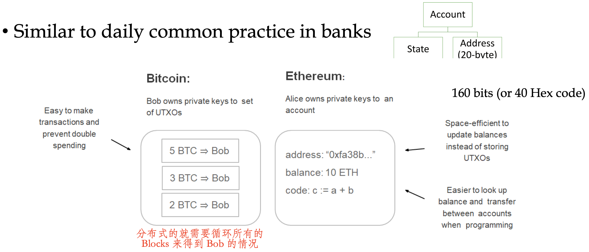

因为没有 UTXO 存在了，我们是否就要担心双花问题了呢？NO！因为 Sender broadcasts multiple different transactions using the same account. 也就是说重复花就会重复减钱，因此 Sender 绝对没有动机进行双花并广播。

但是新的问题出现了：Replay Attack. Receiver broadcasts the same transaction to the network. 也就是说 Receiver 有强烈的动机对智能合约进行重复广播，进而重复获利。解决思路可以是：在交易中加入**nonce** 表示某账户的**交易编号**（从 0 到正无穷），必须维护好 nonce，重复出现是不被允许的，如果被人为修改就可以检测出错误。


**Account Type 分为两种（Externally owned account 和 Contract account）**

- Externally owned account（外部拥有帐户，类似于银行帐户）是用户直接控制的账户，主要功能是发起交易。用户通过EOA可以发送以太币、部署智能合约、与智能合约交互等。它是用户与以太坊网络交互的入口，用户通过私钥来控制账户的操作
  - Protected by signature of users; 安全性依赖于私钥的保管。只有拥有私钥的人才能对账户进行操作，如发送交易、转移资产等。私钥的丢失或泄露会导致账户的控制权丧失或资产被盗
  - Nonce is used for sequence #; EOA主要包含nonce（交易计数器）、余额等基本信息，没有复杂的存储结构
  - Can initiate a transfer or trigger contract account to run code; EOA主要用于用户的日常操作，如资产管理和交易发起。它是用户与区块链交互的主要方式
- Contract account（合约帐户，类似于 ATM 机）合约账户的行为完全由其内部的智能合约代码决定。代码逻辑定义了合约账户如何响应外部交易或消息，以及如何与其他账户交互。合约账户没有私钥，因此不能像EOA那样被直接控制
  - Including code and storage 合约账户除了包含nonce和余额外，还包含存储根（storageRoot）和代码哈希（codeHash）。存储根指向合约的存储数据区，代码哈希指向合约的代码。这使得合约账户能够存储和管理复杂的状态信息
  - CANNOT start a transfer 合约账户只能在接收到外部交易或消息时才执行操作。它本身不具备主动发起交易的能力，必须依赖外部账户的触发
  - Anyone can create; Publicly accessible and anyone can call;
  - Also uses nonce to keep track of sequence #;

**Account Fields**

账户中包含以下字段内容：

- `nonce`: # transactions sent or # contracts created
- `balance`: # Wei owned (1 ether=10^18Wei) ETH 的粒度比 BTC（1 BTC = 10^8 Satoshi）还要细
- `storageRoot`: Hash of the root node of a Merkle Patricia tree. The tree is empty by default.
- `codeHash`: Hash of empty string / Hash of the EVM (Ethereum Virtual Machine ) code of this account

### 7.3 Merkle Patricia tree

**Concept**

- A data structure for **storing key/value pairs** in a cryptographically authenticated manner.
- The tree root is **a hash of all key/values in the structure**, where updates/deletions are fast.
- Patricia 本质是对 Trie 字典树的压缩，因为 ETH 的 Address 有 160 bit 所以根据其构造的 Trie 是很稀疏的，因此用 Patricia 更好

这个可以用来存储 ETH 的状态。结合之前的概述，基本可以明确 ETH 本质是一个状态机，每一个 Block 保存的一个 Hash 和 State 对，如果像 BTC 一样一直对 State 进行反复维护，成本太高了，所以需要找寻新的存储结构，将 Hash 和 State 都存好。


**Motivation for Merkle Patricia Trie**

- Merkle Patricia tree 会存储 The states of all accounts
- Temper resistant 防篡改
- Existence and non-existence proof 容易进行存在和不存在证明

**Modified Merkle Patricia Tree (MMPT)**【必考点】

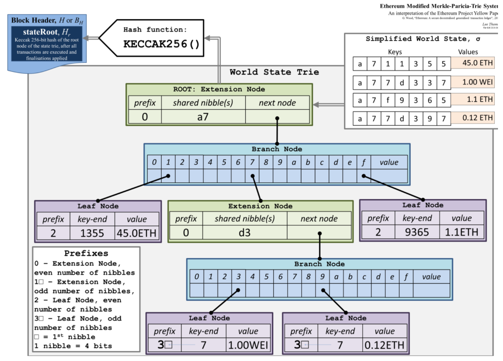

ETH 是用了改良版的 MPT 进行 State 的存储，完成 key-value 对的存储，十分高效便捷。注意其中 nibble 的含义，到时候让写 prefix 一定要正确！

**树的根取哈希值存在 block header里。**对于状态树，每个区块都要**产生一个新的 MPT**，但是这个 MPT 和之前的 MPT 大部分节点是相同的，**只需要增加新的分支即可**，不在原地改的原因是**为了保留历史信息**。临时性分叉很常见，如果要在原地进行修改，考虑到未胜出的节点需要 roll back，同时**智能合约的实现使得通过交易反推之前的状态是不可能的**，所以我们没有办法推断智能合约之前的状态！为了实现回滚的效果，我们需要保留历史信息，就像下面的图示一样。

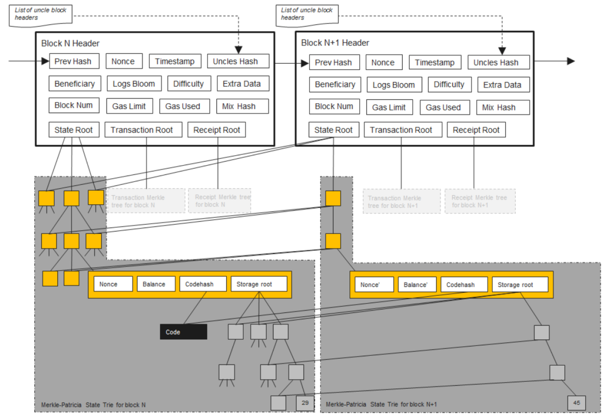


## Lecture 8. Ethereum Tries

> 上一章我们详细理解了以太坊的基本原理，这一章开始进入到第一大核心 —— 四种树的具体组织形式。
>
> 这些树底层数据结构**都是 MPT**
>
> **Which Trie to Use?**
>
> - **What is the current balance of a given account? (S)** 状态树保存账户均衡
> - **Does a given account exist? (S)** 状态树村有账户对
> - **Given a transaction, figure out whether it has been included in a particular block? (T)** 交易树存有交易记录
> - **Tell me all instances of an event of type X (eg. a crowdfunding contract reaching its goal) emitted by a particular address in the past 30 days (R: through the set of logs stored in receipt tries)** 收据树存有具体的操作日志

### 8.1 Overview

**Overview of 3 Tries**


**Block Header Information**


Block 的头极为重要，包含了三根树的地址，也就表示了整个 Block 的基本状态。

### 8.2 World State Trie (Word State Trie + Account Storage Trie)

**Concepts**


- The state root is the **hash of the MPT** of all accounts.
- A new block **only contains modifications** caused by transactions, 没有变化的直接给 hash 值
- Why such a structure ? -- to support rollback（这一个点的具体原理在上一章详细说明了）

**World State**

State Trie 本质记录的是状态的快照，实际上就是状态机。中间的修改内容存在新的状态中（很显然）。


其中的状态是 Account State，本质是 Key - Account State 的一个 Pair，key 是 Address。

**Account State**


两种不同的 Account 中存储的具体内容有区别，但是结构都是一致的。当然，Key 的生成方式也存在区别：


### 8.3 Bloom Filter

A Bloom filter is a space-efficient probabilistic data structure, conceived by Burton Howard Bloom in 1970, that is used to test **whether an element is a member of a set**. 和 SMT 提出来的初心是相同的，核心是为了检查集合中是否有元素

- Easy to check the **non-existence** of elements (能够很直观、准确地判断元素不在集合中)
- False positive matches are possible (算法可能误元素在集合中，出现假阳性)
- Very hard to delete elements (很难删除元素)

算法的原理理解起来比较简单，就是将集合中的元素依次通过 Hash 计算对应到相同的一个空间中，遇到待检验元素后进行空间比较。

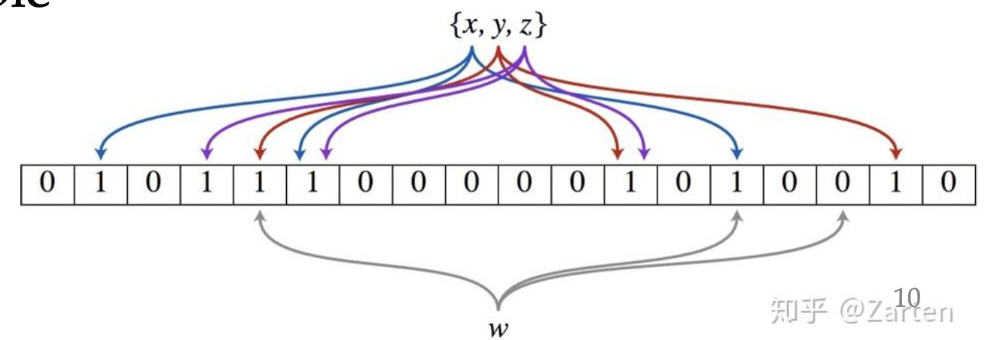

### 8.4 Transaction Trie

**Special Transactions**

如下图所示，交易类型就有两种，一种就是正常的账户间交易（一定都是从 EOA 开始的），一种是账户的创建。


- Contract Creation 指的是 Contract Account 的构造，产生新的 Account State

  

- Message Call 指的是完成交易信息，改变已经存在的 Account State

  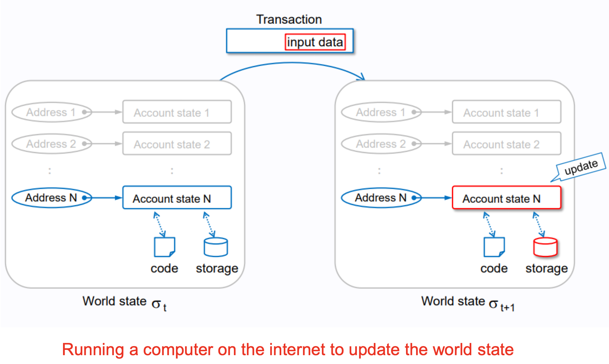

**Messages**

在这单独考虑较为常见的交易信息传递方式，但是尽管 EVM 可以在 CA 中发信息，但是 Transaction 的起源只能来自 EOA

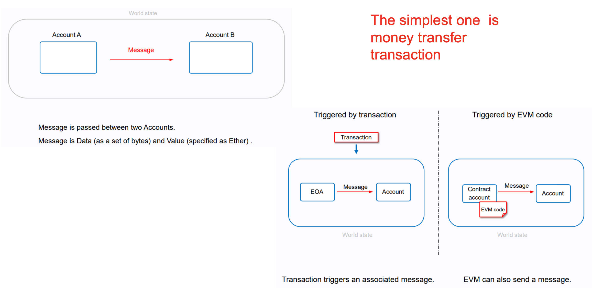

两种常见的 Message Calling Chain

- EOA1 转账给 EOA2

  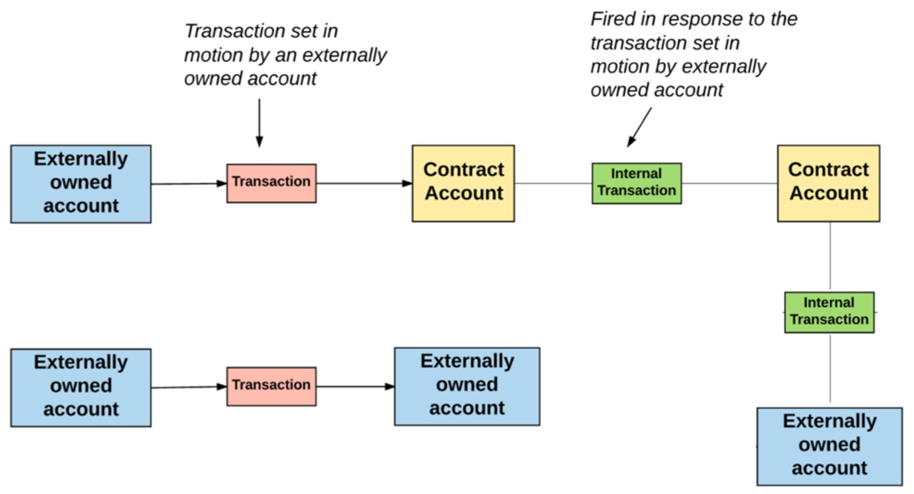

- EOA1 和 EOA2 共同为 Transaction 签名

  

**Fields of Transactions**

Transaction Trie 中的具体的属性有哪些？其中比较关键的就是 `to` 的地址，`gas` 的含义后面会详细说明


### 8.5 Receipt Trie

Transaction receipt tries record includes:

- post-transaction state,
- the cumulative gas used,
- the set of logs created through execution of the transaction, and
- the Bloom filter composed from information in those logs（方便快速查询）

**每一个交易产生一个收据**，交易树和收据树一一对应，收据树为了方便查询交易。

Receipt tree always accompany transaction tree

- Therefore independent across different blocks
- Useful to collectively handle frequent query cases conveniently


## Lectue 9. Ethereum Mining

> 基本了解了以太坊的底层构造，下面就开始思考如何维护和运营以太坊，其中的核心就是挖矿。

### 9.1 Revisited

**The size difference between state trie, transaction trie, and receipt trie?** 

大小肯定不一样。A state trie contains the states of all accounts, while a transaction trie and a receipt trie o**nly refer to the transactions** included in the same block.

**Design of State Trie**

Given a block, let the state trie **only store the accounts affected by the transactions** included in the block

- This design is simpler but causes problems
- Need to verify that the sender account has **enough money**
- Need to add the transfer money to the **receipt account**
- The problem is that it takes time to **locate** which blocks contain the sender account and receipt account
- What if the receipt account is a new one?
- Comparing to Bitcoin, only input coins need to be verified, and only when input coins are used.

**Mining**

Bitcoin blockchain: one block **every 10 minutes on average**

- Multiple valid blocks may be generated around the same time, and the network delay causes **race conditions**
- Which block to choose is **up to miners** (individual vs. mining pools)
- The discarded blocks indicate waste of energy and money
- BTC 的挖矿奖励起初是 50 BTC 每 210,000 个区块减半

Ethereum blockchain: one block **every 15 seconds on average**

- An obvious advantage is much higher throughput (flow rate)
- However **more chances to create conflicts**
- Can we take more blocks into the main blockchain?
- PoW 时期 ETH 每个区块的基础奖励是起初是 5 ETH，在 2017 年 10 月 16 日降为 3 ETH，在 2019 年以太坊 1.0 君士坦丁堡分叉后变为 2，**没有定期减半的机制**。

BTC 和 ETH 本质都是运行在 P2P 网络上的终端应用，P2P 网络的传播也需要时间，对于 BTC 而言 10 分钟出一个块和网络传播是匹配的，**分支是临时的**；但是对于 ETH 来说 15 秒出一个块来说，**分支是常见的**。

### 9.2 GHOST

基于上面的分析：BTC 根据最长链原则确定哪一个 Block 有效，其他的都被遗弃是完全可以的，因为广播的速度能跟上，只有少量 Block 被认为无效。但对于 ETH 而言如果还是根据最链原则，系统分叉太多了，大部分的都没法被认定有效。

**Motivation: Mining Centralization Bias**

The chance of a miner to get a valid block is proportional to his/her mining power; however, the chance of the miner to get reward is **much higher if he/her has much more mining power than others**. The consensus here has to take perception into consideration. 尽管每一个矿工挖到区块的概率和其算力正相关，但是成为主链的概率却很低 —— “赢家通吃”。


大型矿池的另一个优势在于其节点多，挖出来的 Block 能更快被别人接收并确认，得到的收益更大。这种不成比例的 Bias 就是我们的 Motivation，这也是 BTC 设计中调整挖矿难度的核心所在，出块的速度不是越快越好。

**Method: GHOST — Greedy Heaviest Object Sub Tree**

- Yonatan Sompolinsky and Aviv Zohar December, 2013
- Does not choose necessarily the longest branch (Also award blocks not taken into the longest branch)
- Evaluates if the root of the subtrees should be part of the branch that is decided
- To absorb forks as much as possible, as quickly as possible
- To encourage all miners to work together on the same blockchain

核心设计在于会给非最长链上的 Block (Uncle Block) 一定的奖励，奖励的设计机制如下（此处我们总结了改良的 GHOST）To keep the Ethereum system simple and robust!

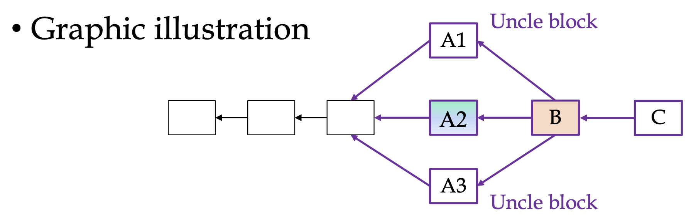

- A1 and A3 are Uncle blocks for B, while A2 is the parent block for B. A block still **has to be validated to be qualified as an uncle block**. B 在引入 A1 和 A3 的时候不会对这两个 Uncle Block 内部的 Transaction 做任何检查，只需要确认 Uncle Block 是难度合法的不是随便发的就可以了。
- **All transaction in an uncle block will be discarded**. The transactions not included in the main blockchain will have to be mined by other miners. Therefore **no transaction fee** reward for uncle blocks. 不用担心在 Uncle Block 中的 Transactions 怎么办，只需要稍作等待在后续引入即可。
- When B block is mined, **A1 and A3 can be included as uncles**, so that both miners of A1 and A3 will be rewarded together with B’s miner. A1 和 A3 被包含，他们是初代 Uncle，所以能够获得 $\frac{7}{8} \times \text{static block reward}$ ETH 奖励。**叔父区块最多可以在 7 代内被认可，但奖励会随着代际增加而递减**
- B block 之所以原因包含 A1 和 A3 两个 Uncle Block 也是因为这样能**获得额外奖励**. Miner of B get $\frac{1}{32} \times \text{static block reward}$ for each uncle block，所以 B 总共能获得 $2\times\frac{1}{32}\times 2 + 2$（两个 Uncle Block 的额外奖励 + 挖出区块的 ETH 奖励）
- 一个区块**最多能够涉及 2 个 Uncle Blocks**，这个限制可以保证 Uncle Block 不那么泛滥
- Uncle Block 后挖出来的新区块没有任何意义。The blocks after the uncle block will be discarded with no reward at all, which discourages forking and attack.

<font color="red">**下面来一个例子对 Reward 进行更为详细的说明【必考点】**</font>：

- `Height = 12675123` 的这个区块引入了 1 个 Uncle Block，其 Reward 如下（只有 Uncle Reward + Gas Fee + Uncle Reward）

  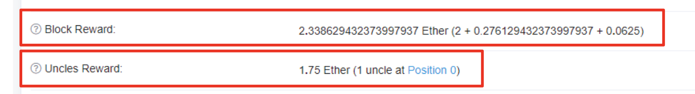

- 其对应的 Uncle Block 的 Reward 为（只有 Uncle Reward，没有 Gas Fee）

  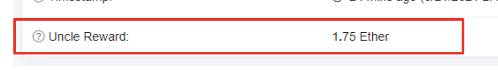

- 其 Parent Block `Height = 12675122` 的 Reward 为（Block Reward + Gas Fee）

  

上述的设计可以解决如下三个常见的缺陷

- Q1: 有的区块就是不包含 Uncle Block，可能是故意的（Miner 损人不利己），也可能是不小心的（没注意到 A1 的存在）

  A miner can harvest its own uncle block if needed (for example, the miner of A3 will include A3 when mining C)

  

- Q2: 出现了多于两个的 Block 区块

  Any main chain block can take up to 2 uncle blocks

  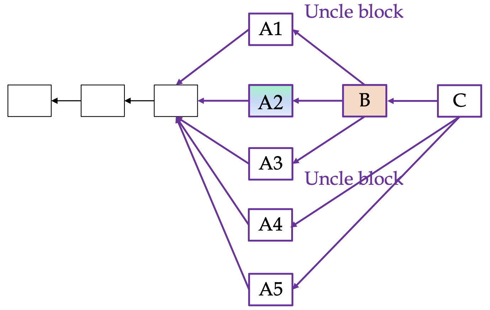

- Q3: Go upstream and create uncle blocks at the very beginning of the main blockchain when difficulty level is low.

  The reward of uncle blocks diminish to 0 over the last 7 generations.  7 代间的 Uncle 收益递减，超出 7 代不再有奖励，但是合并 Uncle Block 的收益都是 1/32，是不变的。

  

  这样的设计存在两个好处：1）鼓励出现分叉后今早合并；2）减少存储数量，不用记太久之前的状态。

这种设计在现实中是被证明有效的，对现实中的一些例子进行总结后就可以发现：

- Most blocks are mined following the main blockchain.
- Most uncle blocks are mined within one generation. Very few blocks are mined with 2 or more generations. Note block reward = 2 Ethers
- In the early days, it is easy to see uncle blocks with more than 2 generations apart. (When Note block reward = 5 Ethers)

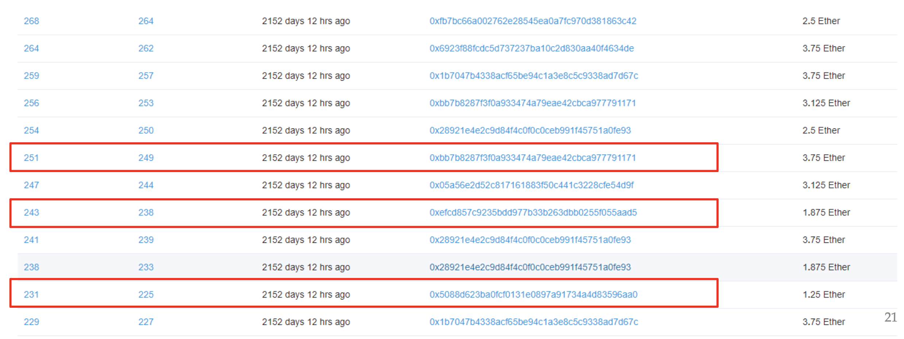

关于 Reward 我们在此再给一个 `Block Reward = 5` 同时有 2 个 Uncle Block 的例子。要学会通过 Height 判断 Uncle 是第几代的，在这明显是两代前，$\frac{6}{8} \times 5 = 3.75$


### 9.3 Ethereum Mining Algorithm

BTC 的挖矿算法是比较成功的，是经过时间检验的。但是挖矿的权利向 ASIC (Application-Specific Integrated Circuit) Mining Machine 拥有者倾斜，正常的家用 PC 机基本挖不到矿！这和中本聪 One CPU, One Vote 的想法是背道而驰的。

所以后续的加密货币设计的时候，遵循 ASIC resistance (memory hard mining puzzle) 原则， 对 ASIC 芯片不友好的需要存储空间较大的 mining puzzle，增加算法中对内存的需求。比如 Scrypt

- Force hash functions to read memory instead of registers only
- Require a large set of memory to save path dependent information (recursive algorithm), time memory tradeoff. 本质是循环算法，有前后依赖关系，必须有足够大的存储空间存储既定值。这是一种时间空间平衡的设计。

但是这种方法对于轻节点而言，也是 memory hard 的，在轻节点的验证的时候也需要很大的空间存储。

LiteCoin 要求的存储空间只有 128K，所以解决了“能启动”问题（Network Effect），但是没有达到设计的目标！Scrypt 的 Puzzle 无法对芯片造成实质性影响。

**Two data sets** 都是定期增长的

- 小 Dataset — Cache 16M: easy for light nodes to verify blocks
- 大 Dataset — DAG 1G: generated from Cache, used by full nodes (从 Cache 里面按照依赖顺序进行循环读取)

**Three Steps**（这个本质还是 PoW 的方式）

- **Step I: Generate 16M cache.** starting with a random seed and generate values in sequence using hash functions

  ```python
  def mkcache(cache_ size, seed):
      o =[hash(seed)] # 第一个元素是种子的 hash
      for i in range(1, cache size):
          o.append(hash(o[-1])) # 循环添加
      return o
  ```

  cache 每隔 3W 个区块会变化，同时 cache 增加原本的 1/128 也就是 128K

-  **Step II: Generate dataset.** Utilizing the elements in the Cache and hash values of these elements to calculate element in dataset. 然后反复调用 `calc_dataser_item`，完成 dataset 全数据的生成

  ```python
  def calc_dataset_item(cache, i):
      cache size = cache.size
      mix= hash(cache[i % cache_size]^i)
      for j in range(256): # 反复读取 256 个次, 生成 dataset 中的第 i 个 item
          cache_index=get_int_from_item(mix)
          mix = make_item(mix, cache[cache index % cache size]) 
      return hash(mix)
  ```

  同样也是每隔 3W 个区块会变化，同时 dataset 增加原本的 1/128 也就是 8M

- **Step III: Finding nonce meeting difficulty.** Use the given nonce to **find 128 elements in the dataset** and calculate their hash to see it meets difficulty level. (Repeat 64 times to finally get cache, each time 2 elements are selected)

  ```python
  def hashimoto full(header, nonce, full_size, dataset):
      mix = hash(header, nonce)
      for i in range(64): # 64 轮循环, 每一次读取 2 个
          dataset_index = get_int_from_item(mix)% full_size
          mix = make_item(mix, dataset[dataset index])
          mix = make_item(mix, dataset[dataset index +1])
      return hash(mix)
  ```

  验证的时候用到的是 cache，从 `dataset` 中取数据变成了从 `cache` 中生成数据。所以矿工为了加速计算必须保存 `dataset` 但是轻节点计算直接保存 `cache` 就可以了。

目前 ETH 的挖矿以 GPU 为主，起到了 ASIC resistance 的目的，比较成功。但 ASIC resistance 一定是好的吗？平民参与进来发动攻击的成本反而降低了，更不安全？

### 9.4 Proof of Stake

上述整体的过程还是 PoW，十分浪费资源！2022 年后 ETH 改为了 PoS（Proof of Stake，权益证明）方法。在 PoW 阶段，挖矿表面上比的是算力，底层本质比的是投入资金，那为什么不能直接比投入资金的多少呢？省去挖矿的过程！这就是 PoS 提出的核心动因！

The Proof of Stake (PoS) concept states that a person can **mine or validate block transactions according to how many coins** they hold. This means that the more coins owned by a miner, the more mining power they have:

- Save energy ? 很显然
- ASIC vs. general computing 完全没有使用 ASIC 的理由了，因为没有挖矿的过程了
- More resistant to attack? (From internal or external) BTC 整个运营过程其实是非闭环的，BTC 的获取依靠机器，机器的获取依靠现实中的法币，因此如果有机构投入了足够多的法币，既可以实现 51% 攻击！但是改成 PoS 后就变为内部依靠了，要想攻击必须要从加密货币内部获得，无论你在外界有多少钱，都不会对加密货币系统造成直接影响。
- Fundamentally different from PoW


## Lecture 10. Smart Contracts and Gas

> 在最开始讲 ETH 的时候就已经明确其底层是一个个合约，在这一章我们单拿出来做更详细的说明

### 10.1 Smart Contract

**Concept** 智能合约就是一段代码！

A smart contract is **some code** that facilitates, verifies, or enforces the negotiation or execution of a digital agreement.

- Main fields:
  - Balance: account balance
  - Nonce: sequence number
  - CodeHash: contract code
  - StorageRoot: MPT for internal storage
- Solidity is the main programming (language, similar to JavaScript)

**Example of Auction House**

在此以房子拍卖作为一个例子，将房子拍卖的过程写成一个智能合约，进行操作。

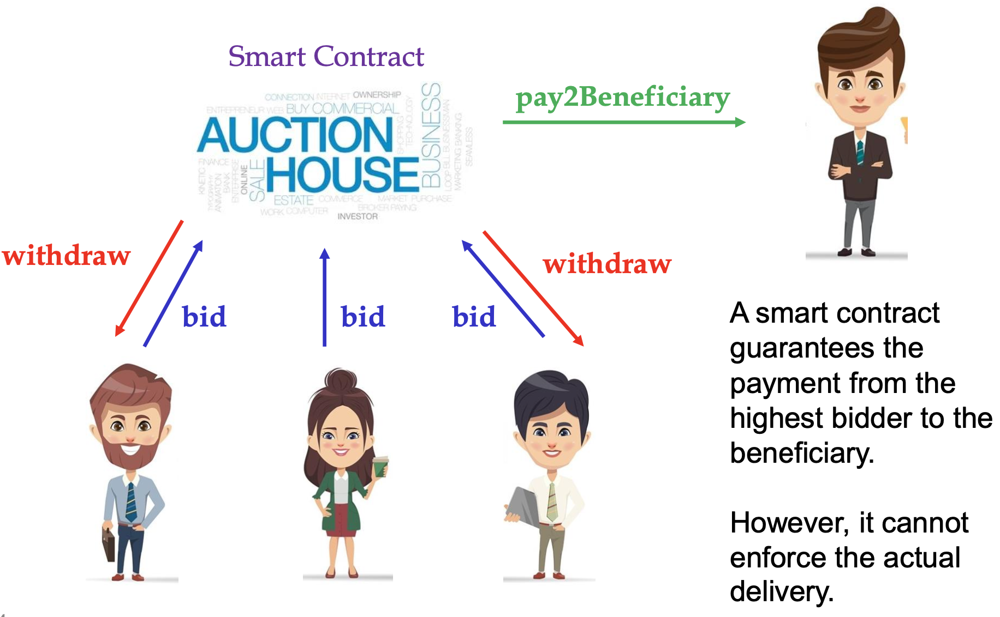

本质还是面向对象进行变编程，需要搭建好对象，以及具体的使用操作，还是以上面的内容为例，完成拍卖过程的合约调用如下，其中主**要是 EOA 调用 CA 的过程**。

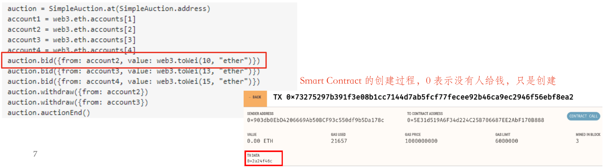

其中的这个 Transaction 合约的关键在于左下角的 `TXDATA` 代表需要运行的函数。中间的一系列值是函数的参数，`VALUE` 是 0 表示只想创建一个合约进而调用函数，而不是真的进行转账。

当然 CA 内部也可以调用 Contract Function 分为两种途径：

- **Direct call**: From a contract account function, call a function in another contract. If some function call fails, all function calls will be rolled back and the original states will be restored. 失败了就全部回滚

  ```solidity
  a.foo("call fool directly");
  ```

- **Call by address**: Call-by-address does not return the actual return value, instead only returns the status of function calling.

但是一定要注意，只有 EOA 才能够创建一个合约!

**fallback()**

A **default function** called by smart contract if

- Some EOA account just wants to transfer Esher
- 未定义函数：The invoked function call from either an EOA or a contract account is not defined

**Creating A Smart Contract**

刚才说了两种智能合约的调用方式，现在看智能合约的构造方式。智能合约发起的本质是 EOA 构造了一个 Transaction

From an EOA initiate a transaction:

- Set the To address as 0x0 (null). null 地址表示这根本不是一个转账，而是创造了 smart contract
- Set transfer value as 0 Esher, but Pay gas fees. 转的也是 0 个 Esher, 但是一定要 Pay gas fees, 不然矿工不会打包的
- Put contract code in init/data field. 将代码放在交易的数据域中
- Smart contract is compiled as bytecode and runs on Ethereum Virtual Machine 编码成 bytecode 并借助 EVM 实现可移植性


### 10.2 Gas

通过以上学习，我们能很清晰比较出 ETH 的代码设计复杂度要比 BTC 大得多，其追求图灵完备性，那出现死循环怎么办？

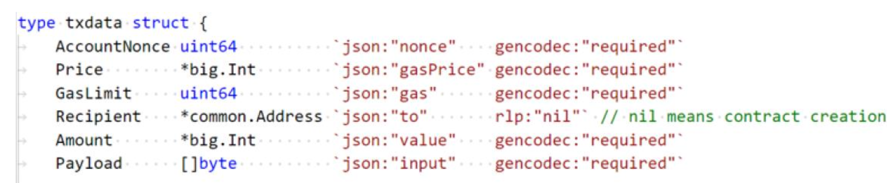

**Concept**

以太坊引入了汽油费机制，要求 EOA 支付汽油费

> 以下内容就可以回答该<font color="red">**【问答题】Gas plays an important role in the Ethereum and it is the unit in which all computation in Ethereum is priced. A transaction in Ethereum has two important fields, gasLimit and gasPrice. Explain the definitions of these two fields and the importance of setting these two fields proper values.**</font>

- Incentive for miners to validate transactions besides the block reward
- Paid by the EOA who initiates the transaction
- Preventing denial of service attack from malicious nodes 有发送 Transaction 的成本，恶意攻击的成本很高！
- Preventing infinite loop contract code execution (what is the damage?)  每调用一个函数就用一点
- Depending on the complexity of the transaction, the gas fee is different 交易复杂度不同，gas fee 也不同

其中：

- **Gas Limit**：Max number of computational steps the transaction is allowed (A safety mechanism to protect transaction sender‟s account balance. A prepaid gas amount for miners to make decision).
- **Gas Price**：Max fee the sender is willing to pay per computaiton step. The value that the transaction sender is willing to pay per gas unit.

$$
\text{Gas Limit} \times \text{Gas Price} = \text{Max Transaction Fee}
$$

思考：为什么需要两个参数，**一个参数表示 Gas Fee 总共是多少不行吗**？因为不是所有的 Gas Fee 都能被矿工赚到手，所以在选择的时候，矿工看的实际上是单价，而不是总体的 Max Fee。A miner usually selects the transaction with the highest gas price. The total gas consumed by a transaction depends on **its complexity**; given the same complexity of transaction, the higher gas price, the more the fees.


另外：Recipient 表示收到 EOA 的地址，Amount 表示转账金额，Payload 表示调用函数和参数取值。

**Gas Consumption** 

一旦发起，就先把最多可能的 Gas Fee 全部从 EOA 中扣掉，然后采用的是“多退少错”的方式：

- 如果多了就退回原账户：The sender is refunded for any unused gas at the end of transaction. 

  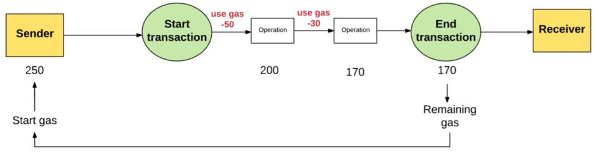

- 如果少了交易就会报错：The transaction runs “**out of gas**” and is considered invalid. The changes are reverted but **no gas is refunded to the sender**. 如果不够，交易会回滚，不会执行，而且 gas fee 不退！

  

**Where Does Gas Go?**

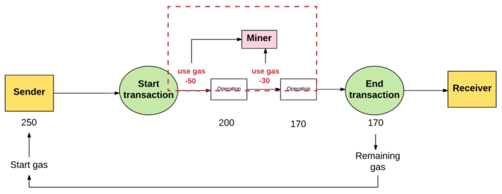

全部跑到矿工的口袋中：A miner deducts the used gas from the sender‟s account, and deposits the gas into the miner's account.

### 10.3 Summary

后续的所讲有关 ETH 的所有内容本质上都是 Miner 参与的挖矿过程，其包括如下步骤：

- Each miner (full node) keeps a **complete set of tries** including state trie, transaction trie, receipt trie, and storage trie **locally**.
- **Each miner** listens to the broadcast of transactions and blocks information and relays the information around.
- For each transaction included in a block (either the new block the miner is working on or the most recent blocks just received from the network), the miner verifies (executes) the transaction.
- Each transaction **consumes gas fees**, the fees collected from executing the transaction go to the miner. The transfer amount and the fees will be deducted from the transaction sender‘s account. And the accounts of the transaction receivers and miner will be credited with appropriate amount.
- The miner then computes the hash values of all roots. If the block is received from the network, the miner **asserts that the hash values match**.
- If the block is the **new block** (not from network), the miner finds a proper nonce to adjust the block hash to **meet the current difficult level**, and then broadcasts the block ASAP.

**Related Questions**

- Will the block contain a complete set of tries including state trie, transaction trie, receipt trie, and storage trie? No!
- Can a miner ignore block verification (execution of transactions)? Yes (Uncle Block)
- What if many miners ignore block verification? 不会的，因为整个系统就会全部崩溃
- What if there are conflicting transactions in the block being worked on and the received block? Sender 为自己的支付负责，出现了冲突都按照正常处理
- Does it make sense to keep working on the current block even when there is a new block received? 叔父节点后续没有意义